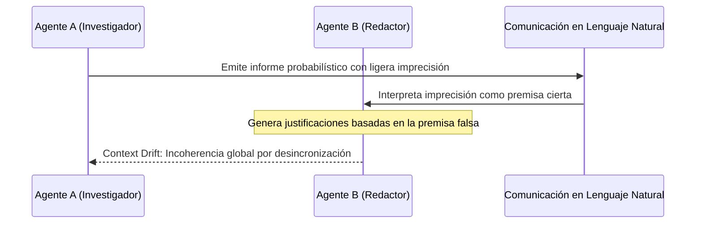

# Alucinaciones en Sistemas Multi-Agente y Deriva de Contexto (Context Drift)

**Categoría Padre:** [[Antecedentes/Alucinaciones]]
**Relaciones 5W1H+:**
* [grounded_by:: [[Source_PDF_arxiv2502_01234_pdf]]]
* [explains_failure_of:: [[Acoplamiento_Neuro_Estocastico_Simbolico]]]
* [is_solved_by:: [[BlockMatrix]]]
* [explains_failure_of:: [[WiGame]]]
* [explains_failure_of:: [[Matriz_por_Bloques]]]
* [explains_failure_of:: [[Matrices_y_Tensores]]]

---

## Qué es
Es la clase de alucinación emergente que surge en sistemas donde múltiples agentes de IA colaboran, no por incapacidad del modelo base, sino por la **desincronización de sus estados lógicos y de contexto**.

---

## 1. El Mecanismo del *Context Drift* (Deriva de Contexto)

* **Divergencia de Suposiciones:** Los agentes divergen en sus coordenadas temporales, espaciales o en el historial de ejecución.
* **Alucinación de Interfaz / Comunicativa:** Cada agente razona de forma individualmente verosímil, pero la falta de un bus de estado inmutable compartido produce contradicciones fácticas globales.

---

## 2. Incremento de Alucinaciones en Agentes
La literatura reciente demuestra que la interacción puramente en prosa entre agentes eleva las alucinaciones hasta un **+34%**, debido a la acumulación de errores de exposición y desincronización del contexto local.

---

## 📚 Fuentes Científicas y Archivos PDF en el Repositorio

* 📄 **Liang et al. / Survey (2025)**: *LLM-Empowered Multi-Agent Systems and Context Synchronization*
  * PDF en Repositorio: [agents2025survey.pdf](file:///home/jp/proyectos/Matrix/limits_of_continuous_llm_training/pdf/agents2025survey.pdf)
  * Clave BibTeX: `@article{agents2025survey}`
* 📄 **Feldman et al. (2023)**: *Trapping LLM Hallucinations Using Tagged Context Prompts*
  * PDF en Repositorio: [arxiv2306_06085.pdf](file:///home/jp/proyectos/Matrix/limits_of_continuous_llm_training/pdf/arxiv2306_06085.pdf)
  * Clave BibTeX: `@article{feldman2023trapping}`

---

## Solución desde Matrix
En lugar de pasarse cadenas de texto estocásticas, los agentes se comunican e inscriben sus estados en la **Matriz por Bloques Omnirepresentativa $\mathbf{M} = \begin{pmatrix} \mathbf{WC_i} & \mathbf{S_i} \\ \mathbf{S_i^T} & \mathbf{V_i} \end{pmatrix}$**, compartiendo un bus de estado Booleano determinista e inmutable que erradica el *Context Drift*.
