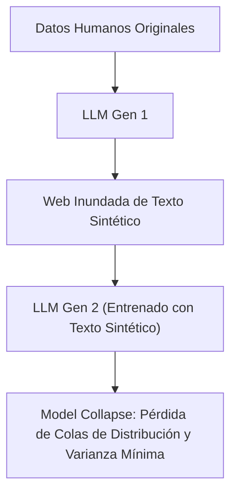

# Causas Estructurales y de Entrenamiento de las Alucinaciones

**Categoría Padre:** [[Antecedentes/Alucinaciones]]
**Relaciones 5W1H+:**
* [grounded_by:: [[Source_PDF_nature_shumailov2024_pdf]]]
* [explains_failure_of:: [[Arquitectura_Neuro_Estocastica]]]
* [explains_failure_of:: [[Taxonomia_SOTA_Alucinaciones]]]
* [explains_failure_of:: [[Discretizacion_Logica_vs_Continuo]]]
* [explains_failure_of:: [[Hecho_Atomico_CDV]]]

---

## Qué es
Es el análisis de los mecanismos patológicos introducidos durante la fase de pre-entrenamiento, ajuste fino y decodificación estocástica de los LLMs.

---

## 1. Asociación Estadística vs. Verdad Factual
Los LLMs no son bases de datos verificadas; predicen el siguiente token estadísticamente. Si en los datos de entrenamiento el signo *"Sídney"* ocurre frecuentemente junto a *"Australia"*, el modelo es propenso a afirmar que Sídney es la capital en lugar de Canberra.

---

## 2. Ocultamiento del Conocimiento (*Knowledge Overshadowing*)
Existe una **ley log-lineal** donde el conocimiento dominante y popular en el corpus eclipsa al conocimiento menos prominente de la "cola larga", forzando alucinaciones sobre entidades poco frecuentes.

---

## 3. Sesgo de Exposición y Efecto Bola de Nieve (*Snowballing*)
Durante la decodificación autorregresiva, si el modelo comete un pequeño error inicial, este se incorpora al contexto. Para mantener la coherencia probabilística con su propio error previo, el modelo comienza a inventar justificaciones falsas en prosa (*Efecto Bola de Nieve*).

---

## 4. Colapso del Modelo (*Model Collapse*)

A medida que los LLMs se entrenan recursivamente con datos sintéticos generados por otros modelos, sufren un proceso degenerativo donde las colas de la distribución desaparecen, colapsando hacia una percepción distorsionada de la realidad.

---

## 📚 Fuentes Científicas y Archivos PDF en el Repositorio

* 📄 **Kommers et al. (2025)**: *Why Slop Matters: Knowledge Overshadowing in Large Language Models*
  * PDF en Repositorio: [kommers2025slop.pdf](file:///home/jp/proyectos/Matrix/limits_of_continuous_llm_training/pdf/kommers2025slop.pdf)
  * Clave BibTeX: `@article{kommers2025slop}`
* 📄 **Shumailov et al. (Nature 2024)**: *AI models collapse when trained on recursively generated data*
  * PDF en Repositorio: [shumailov2024.pdf](file:///home/jp/proyectos/Matrix/limits_of_continuous_llm_training/pdf/shumailov2024.pdf)
  * Clave BibTeX: `@article{shumailov2024}`

---

## Solución desde Matrix
En un semianillo booleano binario, **un hecho raro de la cola larga ocupa exactamente 1 bit ($1$ o $0$), idéntico al hecho más popular**, eliminando el sesgo de frecuencia y el colapso del modelo.
