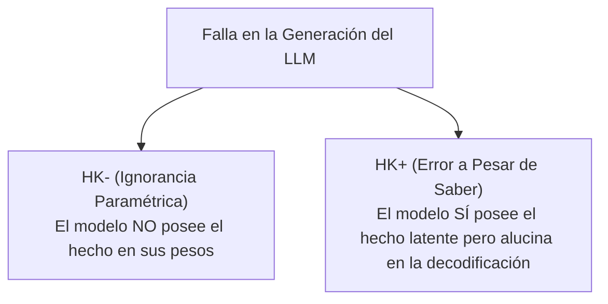

# Diferenciación entre Factualidad, Conocimiento y Alucinación

**Categoría Padre:** [[Antecedentes/Alucinaciones]]
**Relaciones 5W1H+:**
* [explains_failure_of:: [[Taxonomia_SOTA_Alucinaciones]]]
* [explains_failure_of:: [[Arquitectura_Neuro_Estocastica]]]
* [explains_failure_of:: [[Prueba_Necesidad_Representacion_Simbolica_Discreta]]]
* [explains_failure_of:: [[Matriz_por_Bloques]]]

---

## Qué es
Es la redefinición rigurosa del SOTA que desmitifica las alucinaciones en LLMs, dejando de tratarlas como simples "errores" genéricos y categorizándolas según su relación con la realidad externa, los datos de entrenamiento y las representaciones latentes internas.

---

## 1. Factualidad vs. Alucinación (Intrínseca vs. Extrínseca)

* **Factualidad:** Exige que una respuesta concuerde objetivamente con un "oráculo" externo o con el mundo real.
* **Alucinación Intrínseca:** Inconsistencia o contradicción directa con el contexto o prompt proporcionado por el usuario (p. ej., ignorar datos inyectados en RAG).
* **Alucinación Extrínseca:** Información incoherente o no verificable respecto a los datos de entrenamiento del modelo (fabricación pura).

---

## 2. Dicotomía Epistémica: Ignorancia ($HK^-$) vs. Error a Pesar de Saber ($HK^+$)

* **Ignorancia Paramétrica ($HK^-$ - *Ignorance*):**
  * Ocurre cuando la información requerida simplemente no está codificada en los parámetros del modelo.
* **Error a Pesar del Conocimiento ($HK^+$ - *Error despite Knowledge*):**
  * El modelo posee internamente la representación factual correcta en sus capas profundas, pero la decodificación estocástica en la superficie ($S$) se desvía debido a sesgos del prompt, longitud de la respuesta o errores previos.

---

## 📚 Fuentes Científicas y Archivos PDF en el Repositorio

* 📄 **Orgad et al. (ICLR 2025)**: *LLMs Know More Than They Show: On the Intrinsic Representation of LLM Hallucinations*
  * PDF en Repositorio: [iclr2025_a712d4.pdf](file:///home/jp/proyectos/Matrix/limits_of_continuous_llm_training/pdf/iclr2025_a712d4.pdf)
  * Clave BibTeX: `@inproceedings{orgad2025iclr}`
* 📄 **Simhi et al. (2024)**: *Distinguishing Ignorance from Error in LLM Hallucinations*
  * PDF en Repositorio: [arxiv2410_22071.pdf](file:///home/jp/proyectos/Matrix/limits_of_continuous_llm_training/pdf/arxiv2410_22071.pdf)
  * Clave BibTeX: `@article{simhi2024distinguishing}`

---

## Solución desde Matrix
El fenómeno $HK^+$ demuestra la imperiosa necesidad de omitir la decodificación estocástica continua para la extracción de conocimiento, consultando directamente la coordenada binaria en la **Matriz de Verdad Factual ($V_i$)**.
