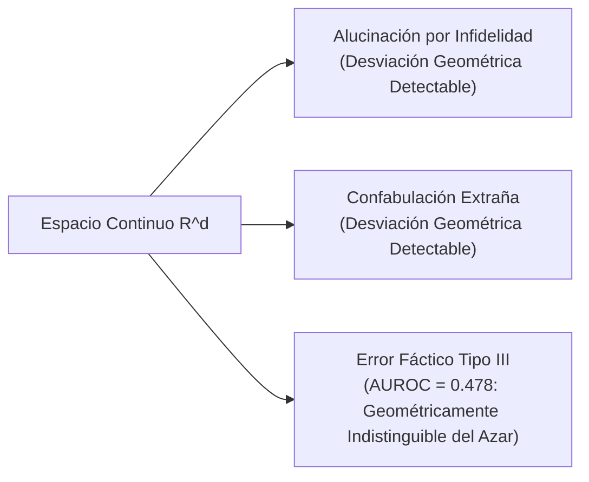

# Origen Geométrico de las Alucinaciones en Espacios Vectoriales

**Categoría Padre:** [[Antecedentes/Alucinaciones]]
**Relaciones 5W1H+:**
* [grounded_by:: [[Source_PDF_arxiv2402_10412_pdf]]]
* [explains_failure_of:: [[Arquitectura_Neuro_Estocastica]]]
* [explains_failure_of:: [[Eje_A_Justificacion_Matematica_Limites_Continuos]]]
* [explains_failure_of:: [[Prueba_Necesidad_Representacion_Simbolica_Discreta]]]
* [explains_failure_of:: [[Representacion_Plana_vs_Tensorial]]]
* [explains_failure_of:: [[Teorema_Suboptimizabilidad_Diagonal]]]

---

## Qué es
Es la explicación matemática de cómo la representación de conceptos mediante vectores continuos (embeddings en $\mathbb{R}^d$) imposibilita la discriminación geométrica de los errores fácticos.

---

## 1. Canales Semánticos y Vectores en $\mathbb{R}^d$

* En los modelos de lenguaje, las respuestas fundamentadas en un dominio específico siguen una "dirección típica" o canal geométrico en el espacio latente de embeddings.
* Las alucinaciones por **infidelidad** (ignorar el contexto) o **confabulación** (inventar texto fuera de tema) se desvían de este canal geométrico y son fácilmente detectables mediante métricas de entropía o distancia de coseno.

---

## 2. La Barrera del AUROC $\approx 0.478$ (Error Fáctico Tipo III)

* **Descubrimiento Central:** El Error Fáctico de Tipo III —afirmaciones incorrectas formuladas dentro del marco conceptual correcto— es **geométricamente indistinguible de la verdad en el espacio de embeddings** (rendimiento AUROC $\approx 0.478$, equivalente al azar).
* **Conclusión Teórica:** Los embeddings codifican exclusivamente la **coocurrencia estadística distributiva**, no la correspondencia factual con la realidad ni el sentido categorial.

---

## 📚 Fuentes Científicas y Archivos PDF en el Repositorio

* 📄 **Wei et al. (2024)**: *Measuring and Reducing LLM Hallucination Without Gold-Standard Answers*
  * PDF en Repositorio: [arxiv2402_10412.pdf](file:///home/jp/proyectos/Matrix/limits_of_continuous_llm_training/pdf/arxiv2402_10412.pdf)
  * Clave BibTeX: `@article{wei2024measuring}`
* 📄 **Sansford et al. (2024)**: *GraphEval: A Knowledge-Graph Based LLM Hallucination Evaluation Framework*
  * PDF en Repositorio: [sansford2024grapheval.pdf](file:///home/jp/proyectos/Matrix/limits_of_continuous_llm_training/pdf/sansford2024grapheval.pdf)
  * Clave BibTeX: `@article{sansford2024grapheval}`

---

## Solución desde Matrix
Demuestra la necesidad de pasar de distancias vectoriales probabilísticas a **coordenadas lógicas algebraicables discretas** ancladas en la **Máscara de Sentido ($S_i$)**.
