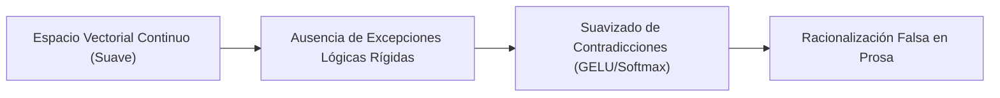

# Ausencia de Señales de Fallo Deterministas en Espacios Continuos

**Categoría Padre:** [[Antecedentes/Limites_Espacio_Continuo]]
**Relaciones 5W1H+:**
* [grounded_by:: [[Source_PDF_quigley2025_pdf]]]
* [is_solved_by:: [[Capa_Sentido_Si]]]
* [explains_failure_of:: [[Prueba_Necesidad_Representacion_Simbolica_Discreta]]]
* [explains_failure_of:: [[Eje_A_Justificacion_Matematica_Limites_Continuos]]]
* [explains_failure_of:: [[Algebra_Booleana]]]
* [explains_failure_of:: [[Maquina_Estados_DFA]]]

---

## Qué es
Es la vulnerabilidad matemática estructural de las redes neuronales continuas por la cual no existe ningún mecanismo interno en la arquitectura estocástica que emita un **fallo determinista rígido** (un *"error de compilación"*) cuando una deducción rompe las leyes lógicas o de sentido.

---

## Causa Matemática y Consecuencias

* **Inexistencia de Excepciones Rígidas:** En un espacio continuo y probabilístico, una contradicción es simplemente un vector más con cierta probabilidad. El modelo no "siente" el choque categorial.
* **Imposibilidad de Autocorrección Autónoma:** Sin etiquetas estructurales o una señal de error binaria discreta externa, el decodificador autorregresivo no puede detener su propio flujo probabilístico ni corregir autónomamente sus falacias lógicas.

---

## 📚 Fuentes Científicas y Archivos PDF en el Repositorio

* 📄 **Nezhad et al. (SymCode 2025)**: *SymCode: A Neurosymbolic Approach to Mathematical Reasoning via Verifiable Code Generation*
  * PDF en Repositorio: [symcode2025.pdf](file:///home/jp/proyectos/Matrix/limits_of_continuous_llm_training/pdf/symcode2025.pdf)
  * Clave BibTeX: `@article{nezhad2025symcode}`
* 📄 **Quigley (2025)**: *Neurosymbolic Deep Learning Semantics*
  * PDF en Repositorio: [quigley2025.pdf](file:///home/jp/proyectos/Matrix/limits_of_continuous_llm_training/pdf/quigley2025.pdf)
  * Clave BibTeX: `@article{quigley2025}`

---

## Solución desde Matrix
El motor MEEL resuelve esta ausencia introduciendo la **Máscara de Sentido Booleana $S_i$**. Cuando una proposición es fuera de categoría (*Unsinnig*), la celda es $S_i = 0$, emitiendo un **error de compilación Booleano determinista** que detiene el flujo estocástico.
