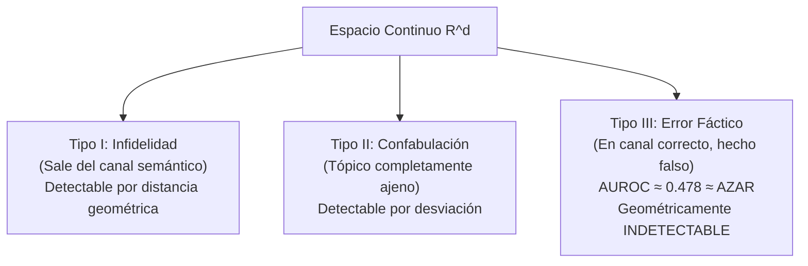

# Barrera de Detección AUROC ≈ 0.478 para el Error Fáctico Tipo III

**Categoría Padre:** [[Antecedentes/Limites_Espacio_Continuo]]
**Relaciones 5W1H+:**
* [grounded_by:: [[Source_PDF_arxiv2402_10412_pdf]]]
* [mathematically_proves:: [[Eje_A_Justificacion_Matematica_Limites_Continuos]]]
* [mathematically_proves:: [[Prueba_Necesidad_Representacion_Simbolica_Discreta]]]
* [explains_failure_of:: [[Origen_Geometrico_y_Espacio_Vectorial]]]
* [explains_failure_of:: [[Arquitectura_Neuro_Estocastica]]]

---

## Qué es
Es el resultado empírico, publicado por Wei et al. (2024), que demuestra que las alucinaciones fácticas de **Tipo III** (afirmaciones incorrectas dentro del marco conceptual correcto) son **geométricamente indistinguibles de la verdad** en el espacio de embeddings, con un rendimiento de detección AUROC ≈ 0.478 — equivalente al azar.

## Taxonomía de los Tres Tipos de Error

| Tipo | Descripción | Detectable en $\mathbb{R}^d$? | AUROC |
|:---|:---|:---|:---|
| **I — Infidelidad** | La respuesta se desvía del contexto | ✅ Sí (distancia al canal) | > 0.80 |
| **II — Confabulación** | Tópico completamente ajeno | ✅ Sí (entropía / fuera de distribución) | > 0.75 |
| **III — Error Fáctico** | Marco correcto, hecho incorrecto | ❌ No | ≈ 0.478 |

## Por qué es una Barrera Estructural

El Error Tipo III es indetectable porque:

1. **La distancia vectorial codifica coocurrencia estadística**, no correspondencia factual.
2. Dos proposiciones que comparten el mismo dominio conceptual ("El ragout tiene champiñones" verdadera vs. "El ragout tiene trufa" falsa) tienen representaciones vectoriales **cercanas** en $\mathbb{R}^d$.
3. La métrica de detección (AUROC ≈ 0.478) demuestra que la separabilidad es **inferior al azar** (0.5).

Esto prueba que la representación continua mide **verosimilitud distribucional**, no **verdad factual**.

## Cálculo del AUROC en Wei et al. (2024)

El framework FEWL (Factuality Evaluation via Weighted Likelihood) mide:
- **No-Halucinación**: $P(\text{correcto}) = 0.522$
- **Halucinación**: $P(\text{detectado}) = 0.478$

El resultado es estadísticamente equivalente a una moneda: el espacio de embeddings **no contiene la señal de verdad** para errores dentro del canal semántico.

## Solución desde Matrix
Solo un sistema que consulta coordenadas discretas ($V_i \in \{0, 1\}$) puede resolver el Error Tipo III: la verdad no es una distancia, es una coordenada booleana.

---

## 📚 Fuente Científica
* 📄 **Wei et al. (2024)**: *Measuring and Reducing LLM Hallucination Without Gold-Standard Answers*
  * PDF en Repositorio: [arxiv2402_10412.pdf](file:///home/jp/proyectos/Matrix/limits_of_continuous_llm_training/pdf/arxiv2402_10412.pdf)
  * Clave BibTeX: `@article{wei2024measuring}`
