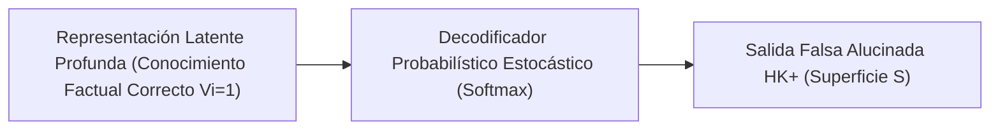

# Incongruencia entre Decodificación Estocástica y Conocimiento Latente

**Categoría Padre:** [[Antecedentes/Limites_Espacio_Continuo]]
**Relaciones 5W1H+:**
* [grounded_by:: [[Dicotomia_HK_Minus_vs_HK_Plus]]]
* [explains_failure_of:: [[Prueba_Necesidad_Representacion_Simbolica_Discreta]]]
* [is_solved_by:: [[Capa_Verdad_Vi]]]
* [explains_failure_of:: [[Arquitectura_Neuro_Estocastica]]]
* [explains_failure_of:: [[Teorema_Suboptimizabilidad_Diagonal]]]
* [explains_failure_of:: [[Matriz_por_Bloques]]]

---

## Qué es
Es la demostración empírica de que **modelar el razonamiento exclusivamente como un proceso de decodificación estocástica sobre un espacio continuo es estructuralmente insuficiente**. Aunque las redes neuronales logren memorizar y codificar hechos correctos en sus pesos latentes, el muestreo probabilístico del decodificador desvía la salida hacia alucinaciones.

---

## 1. El Mecanismo de Falla Epistémica ($HK^+$)

* Auditar los estados latentes intermedios demuestra que el modelo posee la respuesta correcta en sus pesos.
* Sin embargo, el objetivo de maximizar la probabilidad del siguiente token $P(w_t \mid w_{<t})$ es **infiel a la verdad latente**, haciendo que pequeños sesgos probabilísticos en el prompt o errores previos desvíen la decodificación continua hacia afirmaciones falsas ($HK^+$).

---

## 📚 Fuentes Científicas y Archivos PDF en el Repositorio

* 📄 **Orgad et al. (ICLR 2025)**: *LLMs Know More Than They Show: On the Intrinsic Representation of LLM Hallucinations*
  * PDF en Repositorio: [iclr2025_a712d4.pdf](file:///home/jp/proyectos/Matrix/limits_of_continuous_llm_training/pdf/iclr2025_a712d4.pdf)
  * Clave BibTeX: `@inproceedings{orgad2025iclr}`
* 📄 **Simhi et al. (2024)**: *Distinguishing Ignorance from Error in LLM Hallucinations*
  * PDF en Repositorio: [arxiv2410_22071.pdf](file:///home/jp/proyectos/Matrix/limits_of_continuous_llm_training/pdf/arxiv2410_22071.pdf)
  * Clave BibTeX: `@article{simhi2024distinguishing}`

---

## Solución desde Matrix
Demuestra la necesidad de omitir la decodificación continua durante la inferencia y extraer el hechos directamente desde la **Matriz de Verdad Factual Discreta $V_i$**.
