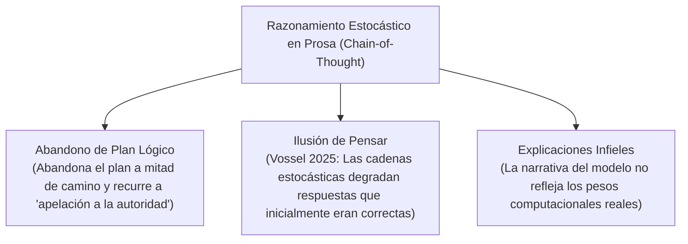

# Infidelidad del Razonamiento en Prosa y la "Ilusión de Pensar"

**Categoría Padre:** [[Antecedentes/Limites_Espacio_Continuo]]
**Relaciones 5W1H+:**
* [grounded_by:: [[Source_PDF_vossel2025advancing_pdf]]]
* [explains_failure_of:: [[Ilusion_de_la_Autocorreccion]]]
* [explains_failure_of:: [[Arquitectura_Neuro_Estocastica]]]
* [explains_failure_of:: [[Acoplamiento_Neuro_Estocastico_Simbolico]]]
* [explains_failure_of:: [[Multiplicacion_Matricial_Booleana_y_Clausura_Transitiva]]]

---

## Qué es
Es el principio demostrado por el SOTA según el cual intentar ejecutar un razonamiento formal de múltiples pasos utilizando exclusivamente texto en lenguaje natural estocástico (*Chain-of-Thought*) genera cadenas de razonamiento **infieles a la computación real subyacente y susceptibles a falacias lógicas patológicas**.

---

## 1. Modos de Falla del Razonamiento en Prosa

* **Abandono de Plan Lógico:** Nezhad et al. (SymCode 2025) documentan que un LLM puede iniciar un plan deductivo correcto pero abandonarlo a mitad de camino y fabricar una "apelación a la autoridad" (inventar un hecho) simplemente porque estadísticamente sonaba verosímil continuar el texto así.
* **La Ilusión de Pensar (*Illusion of Thinking*):** Vossel et al. (2025) demuestran que agregar pasos de razonamiento estocástico en prosa puede degradar el rendimiento al sobrescribir salidas que eran originalmente verdaderas.

---

## 📚 Fuentes Científicas y Archivos PDF en el Repositorio

* 📄 **Nezhad et al. (SymCode 2025)**: *SymCode: A Neurosymbolic Approach to Mathematical Reasoning via Verifiable Code Generation*
  * PDF en Repositorio: [symcode2025.pdf](file:///home/jp/proyectos/Matrix/limits_of_continuous_llm_training/pdf/symcode2025.pdf)
  * Clave BibTeX: `@article{nezhad2025symcode}`
* 📄 **Vossel et al. (2025)**: *Advancing Natural Language Formalization to FOL*
  * PDF en Repositorio: [vossel2025advancing.pdf](file:///home/jp/proyectos/Matrix/limits_of_continuous_llm_training/pdf/vossel2025advancing.pdf)
  * Clave BibTeX: `@article{vossel2025advancing}`

---

## Solución desde Matrix
El razonamiento multi-paso no debe ejecutarse en prosa estocástica, sino en el **kernel Booleano `rule_matrix.py`** mediante Modus Ponens matricial ($v \otimes I^*$).
