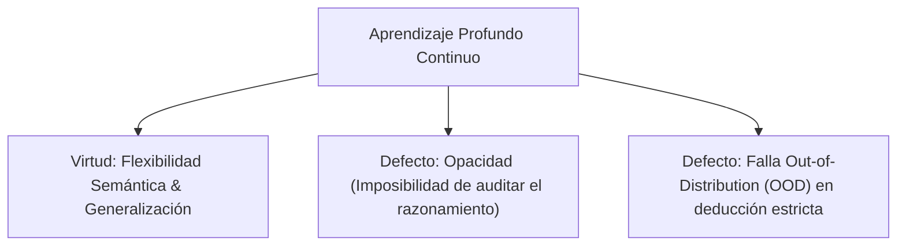

# Semántica Formal Neuro-Simbólica vs. Opacidad Neuronal

**Categoría Padre:** [[Antecedentes/Limites_Espacio_Continuo]]
**Relaciones 5W1H+:**
* [grounded_by:: [[Source_PDF_quigley2025_pdf]]]
* [is_solved_by:: [[Eje_D_Diferenciacion_OWL_KGs_y_Vectorizacion_Bitwise]]]
* [explains_failure_of:: [[Acoplamiento_Neuro_Estocastico_Simbolico]]]
* [explains_failure_of:: [[Prueba_Necesidad_Representacion_Simbolica_Discreta]]]
* [explains_failure_of:: [[Algebra_Booleana]]]

---

## Qué es
Es la justificación teórica que demuestra por qué las redes neuronales profundas continuas, a pesar de su enorme capacidad de generalización estadística, sufren de **opacidad ininterpretable y colapso de rendimiento fuera de distribución (Out-of-Distribution / OOD)**, requiriendo la formalización a través de un marco de semántica discreta.

---

## 1. El Dilema de la Geometría Continua de Aprendizaje Profundo

* **Opacidad y Falta de Auditabilidad:** Los billones de parámetros en espacio continuo impiden verificar exactamente cómo el sistema llegó a una conclusión factual.
* **Composicionalidad Discreta:** La semántica formal sobresale exactamente donde los espacios continuos fallan: es inherentemente auditable por su **composicionalidad Booleana** y aplicable universalmente por su naturaleza abstracta.

---

## 📚 Fuentes Científicas y Archivos PDF en el Repositorio

* 📄 **Quigley (2025)**: *Neurosymbolic Deep Learning Semantics*
  * PDF en Repositorio: [quigley2025.pdf](file:///home/jp/proyectos/Matrix/limits_of_continuous_llm_training/pdf/quigley2025.pdf)
  * Clave BibTeX: `@article{quigley2025}`
* 📄 **Vossel et al. (2025)**: *Advancing Natural Language Formalization to FOL*
  * PDF en Repositorio: [vossel2025advancing.pdf](file:///home/jp/proyectos/Matrix/limits_of_continuous_llm_training/pdf/vossel2025advancing.pdf)
  * Clave BibTeX: `@article{vossel2025advancing}`

---

## Solución desde Matrix
Integrar la semántica formal discreta sobre **palabras de procesador `uint64` (MEEL)**, convirtiendo las inferencias en operaciones matriciales auditables de silicio (`&`, `|`, `<<`) con composicionalidad garantizada.
