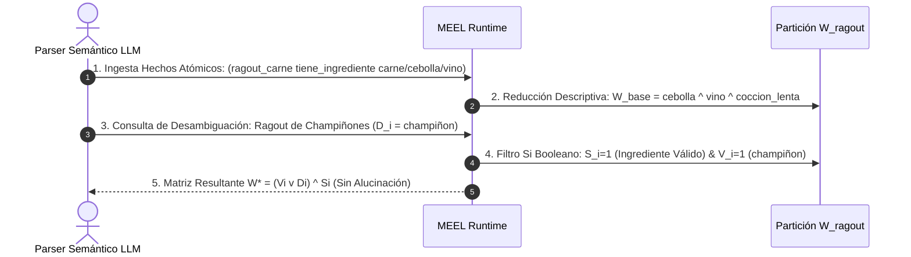

# Demostración en Dominio Culinario: Ragout de Champiñones

**Categoría Padre:** [[Aplicaciones]]
**Relaciones 5W1H+:**
* [implements:: [[Source_Code_examples_ragout_demonstration_py]]]
* [is_solved_by:: [[MEEL]]]
* [is_solved_by:: [[BlockMatrix]]]
* [restricts:: [[WiGame]]]
* [restricts:: [[Acoplamiento_Neuro_Estocastico_Simbolico]]]
* [restricts:: [[Matriz_por_Bloques]]]
* [restricts:: [[Juego_de_Desambiguacion]]]
* [restricts:: [[Colapso_Dimensional]]]

---

## Qué es
Es la demostración end-to-end ejecutable (`examples/ragout_demonstration.py`) que ilustra cómo el motor Booleano MEEL resuelve las ambigüedades categoriales y evita alucinaciones en un dominio culinario real mediante un pipeline de 5 etapas.

---

## Flujo de la Demostración Culinaria

---

## Código Ejecutable de Referencia
* Script Ejecutable: `Matrix/Matrix/examples/ragout_demonstration.py`
* Prueba Pytest: `Matrix/Matrix/tests/test_ragout_demonstration.py` (120/120 tests passing)
