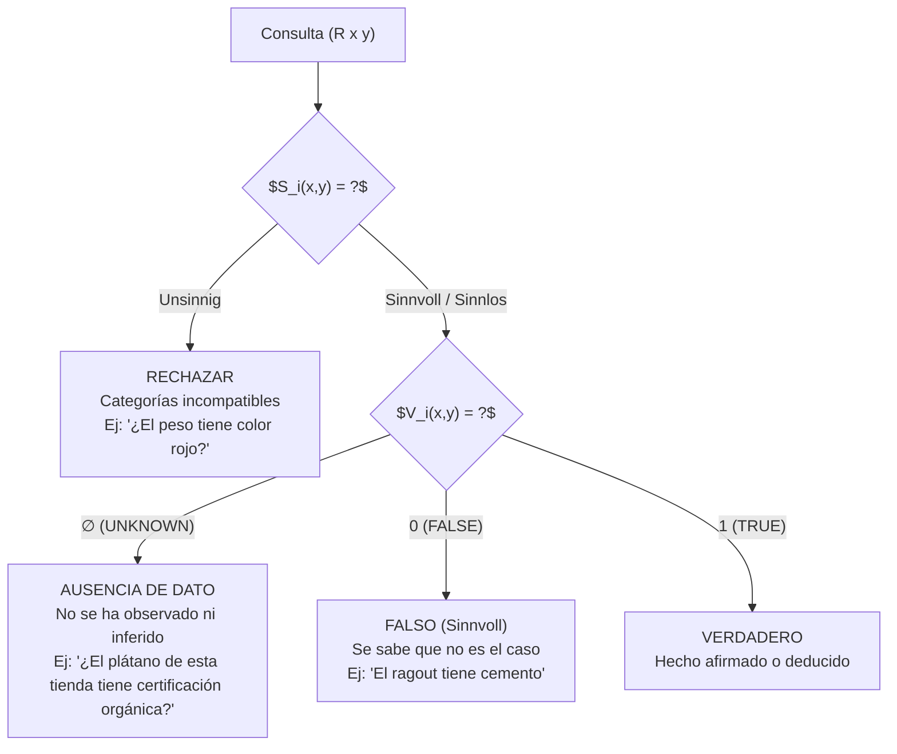

# Distinción Operacional: Ausencia de Dato vs. Inaplicabilidad Categorial (Unsinnig)

**Categoría Padre:** [[Computacion/Estructuras_Matriciales]]
**Relaciones 5W1H+:**
* [implements:: [[Categorias_Sentido]]]
* [implements:: [[Estados_Verdad_Epistemicos_Semanticos]]]
* [implements:: [[Operacion_Identificar_Faltantes]]]
* [is_solved_by:: [[Capa_Sentido_Si]]]
* [is_solved_by:: [[Capa_Verdad_Vi]]]

---

## Qué es
Es el procedimiento operacional que permite al sistema distinguir tres estados distintos para una celda $(x, y)$ en la matriz, evitando la confusión fundamental que causa alucinaciones en sistemas continuos.

## Los Tres Estados Mutuamente Exclusivos



| Estado | $S_i$ | $V_i$ | Estado Epistémico | Significado |
|:---|:---|:---|:---|:---|
| **Unsinnig** | `unsinnig` | N/A | N/A | La combinación categorial es absurda |
| **Ausencia** | `sinnvoll` | `∅` (UNKNOWN) | No observado | La pregunta es válida pero no hay dato |
| **Falso** | `sinnvoll` | `false` | Observado/Inferido | Se sabe que no es el caso |
| **Verdadero** | `sinnvoll` | `true` | Observado/Inferido | Se sabe que es el caso |

## Implementación en el Código

El sistema implementa esta distinción mediante dos enumeraciones separadas:

```python
class SenseValue(str, Enum):
    SINNVOLL = "sinnvoll"    # Tiene sentido (puede ser V o F)
    SINNLOS = "sinnlos"      # Tautología/contradicción (sin info)
    UNSINNIG = "unsinnig"    # Absurdo categorial

class TruthValue(str, Enum):
    TRUE = "true"
    FALSE = "false"
    UNKNOWN = "∅"            # Ausencia de dato, NO falsedad
```

La función `get_status()` en `wi_game_queries.py` ejecuta la decisión:
1. Si $(x,y)$ está fuera de los ejes → `unsinnig` (out of bounds)
2. Si $S_i(x,y)$ = `unsinnig` → `unsinnig` (sense violation)
3. Si la columna es tautológica → `sinnlos` (no discriminativa)
4. Si $V_i(x,y)$ = `∅` → ausencia; si `false` → falso; si `true` → verdadero

## Ejemplo Concreto

En un WiGame de cocina con relación `tiene_ingrediente`:

| Consulta | $S_i$ | $V_i$ | Decisión |
|:---|:---|:---|:---|
| `(tiene_ingrediente ragout champinon)` | sinnvoll | true | ✅ Aceptar |
| `(tiene_ingrediente ragout cemento)` | sinnvoll | false | ❌ Falso (pero válido) |
| `(tiene_ingrediente ragout trufa)` | sinnvoll | ∅ | ⚠️ Ausencia: no sabemos |
| `(peso kg rojo)` | unsinnig | N/A | 🚫 Absurdo categorial |

## Por qué es necesario
Los sistemas continuos no pueden hacer esta distinción: en $\mathbb{R}^d$, todo vector tiene alguna distancia relativa a otro, y la ausencia de dato se interpola suavemente con falsedad o proximidad. Solo coordenadas discretas con `UNKNOWN` explícito permiten auditoría precisa.
