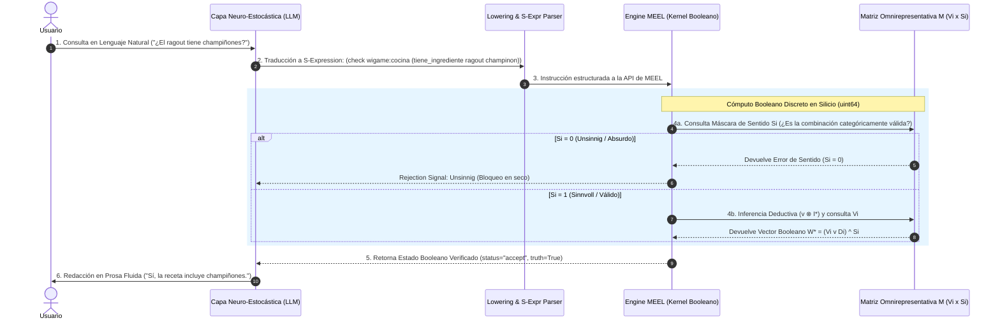

# Acoplamiento Neuro-Estocástico-Simbólico

**Categoría Padre:** [[Computacion]]
**Relaciones 5W1H+:**
* [is_solved_by:: [[Arquitectura_Neuro_Estocastica]]]
* [implements:: [[MEEL]]]
* [is_solved_by:: [[Pipeline_Ingesta_Lenguaje_Matrix]]]
* [implements:: [[S_Expressions]]]
* [implements:: [[BlockMatrix]]]
* [is_solved_by:: [[Matriz_por_Bloques]]]
* [is_solved_by:: [[Multiplicacion_Matricial_Booleana_y_Clausura_Transitiva]]]

---

## Qué es
Es la arquitectura de integración híbrida que desacopla la capa de lenguaje neuro-estocástica (LLM) del kernel de evaluación Booleano discreto (MEEL / Matrix). Permite combinar la fluidez y comprensión semántica del lenguaje natural con la rigurosidad deductiva, inmutabilidad y ausencia total de alucinaciones del silicio Booleano.

---

## Pipeline de Acoplamiento en 5 Etapas

---

## Desglose de Responsabilidades

| Tarea del Sistema | Módulo Encargado | Dominio de Cómputo |
| :--- | :--- | :--- |
| **Parsing Semántico y Fluidez** | Capa Neuro-Estocástica (LLM) | Probabilístico continuo en $\mathbb{R}^d$ (Softmax) |
| **Lowering a S-Expressions** | `lowering.py` & `s_expressions.py` | Parseo Sintáctico AST |
| **Filtro Categorial Anti-Alucinación** | Máscara de Sentido $S_i$ (MEEL) | Compuerta Booleana Binaria ($1$ o $0$) |
| **Inferencia y Deducción Factual** | Matriz $V_i$ & `rule_matrix.py` | Álgebra Bitwise Nativa (`uint64` en $\mathcal{O}(1)$) |
| **Verbalización de Superficie** | Capa Neuro-Estocástica (LLM) | Generación Estocástica Guiada por $W^*$ |

---

## Implementación en el Repositorio
* **Lowering & Parsing:** `prototypes/shrdlu/lowering.py`, `src/operational_model/language/s_expressions.py`
* **Ingesta OWL:** `src/operational_model/language/owl2matrix.py`
* **Runtime de Evaluación:** `src/operational_model/system/s_expression_runtime.py`
* **Ejecución Bitwise:** `src/operational_model/kernel/bitwise_execution.py`
