# Algoritmo de Minimización de Energía de Información E(R)

**Categoría Padre:** [[Computacion]]
**Relaciones 5W1H+:**
* [implements:: [[Source_Code_src_operational_model_optimization_information_energy_py]]]
* [is_solved_by:: [[Energia_Informacion]]]
* [grounded_by:: [[Principio_de_Minimalidad]]]
* [is_solved_by:: [[Representacion_Plana_vs_Tensorial]]]
* [is_solved_by:: [[Reduccion_Descriptiva]]]

---

## Qué es
Es el procedimiento algorítmico determinista mediante el cual el motor refactoriza, poda y divide espacios lógicos ($W_i$) para maximizar la energía de información $E(R)$ (o minimizar la pérdida lógica $\mathcal{L} = 1 - E(R)$).

## Por qué es necesario
Permite que la base de conocimientos se auto-optimice activamente, eliminando redundancias, factorizando tautologías y eliminando celdas inaplicables sin intervención manual.

## Cómo funciona (Paso a Paso)

```mermaid
flowchart TD
    Wi["Espacio Lógico Wi Actual"] --> Eval["Calcular E(R) Actual"]
    Eval --> CheckTaut["1. ¿Existen columnas tautológicas?\n(Poder discriminativo d bajo)"]
    CheckTaut -- Sí --> Promete["Promover columna a dimensión C tensorial (Reducción Descriptiva)"]
    CheckTaut -- No --> CheckAbsurd["2. ¿Existen celdas Unsinnig abundantes?\n(Densidad de sentido c baja)"]
    CheckAbsurd -- Sí --> Split["Escindir Wi en subcontextos W1' y W2'"]
    CheckAbsurd -- No --> CheckCol["3. ¿Existen colisiones (Wi x Wi^T - I > 0)?"]
    CheckCol -- Sí --> Inject["Inyectar propiedad discriminatoria mínima"]
    CheckCol -- No --> Optimal["Estado Óptimo Alcanzado (ΔE <= 0)"]
    Promete --> Recalc["Recalcular ΔE = E(R_nuevo) - E(R_actual)"]
    Split --> Recalc
    Inject --> Recalc
    Recalc -- "ΔE > 0" --> Apply["Consolidar Refactorización"]
    Apply --> Wi
```

### Pasos del Algoritmo:
1. **Poda de Tautologías ($d \to 1$):** Detecta columnas constantes en $V_i$ y las promueve a compuertas tensoriales $C$.
2. **Escisión de Subcontextos ($c \to 1$):** Si la densidad de sentido $c$ cae por presencia de celdas inaplicables ($\emptyset$), divide la matriz en sub-tensores limpios.
3. **Inyección Discriminatoria ($D(M) \to 1$):** Si existen colisiones en $(W_i \otimes W_i^T) - \mathbb{I}$, inyecta la dimensión mínima separadora.
4. **Criterio de Aceptación:** Acepta la mutación si $\Delta E(R) = E(R_{\text{candidato}}) - E(R_{\text{actual}}) > 0$.

## Cuándo interviene
En tareas asíncronas de mantenimiento del motor de base de datos, tras ingestas masivas de datos o durante la compactación de índices.

## Dónde reside
En el optimizador topológico del kernel relacional (`src/operational_model/system/wi_game_queries.py`).

## Para qué / Para quién
Actúa como el algoritmo de "entrenamiento determinista" que mantiene la base de datos libre de redundancias y con rendimiento máximo.
