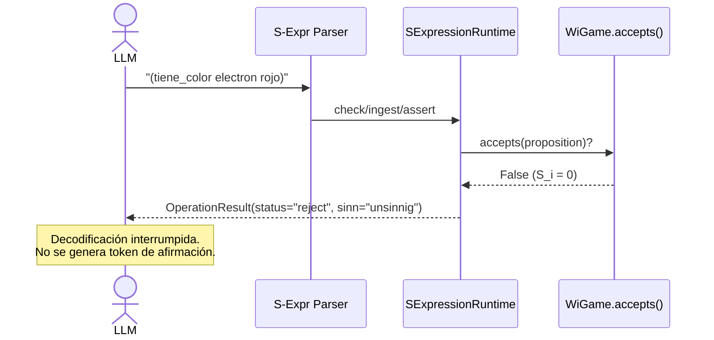

# Mecanismo de Interrupción de Decodificación cuando $S_i = 0$

**Categoría Padre:** [[Computacion/Parsers_y_Runtimes]]
**Relaciones 5W1H+:**
* [implements:: [[Capa_Sentido_Si]]]
* [implements:: [[Acoplamiento_Neuro_Estocastico_Simbolico]]]
* [implements:: [[Pipeline_Ingesta_Lenguaje_Matrix]]]
* [is_solved_by:: [[S_Expressions]]]

---

## Qué es
Es el mecanismo por el cual el runtime MEEL interrumpe el flujo de generación cuando una proposición propuesta por el LLM resulta tener $S_i = 0$ (*Unsinnig*), devolviendo una señal de rechazo determinista que impide que la alucinación se materialice.

## Mecanismo Implementado

El código en `s_expression_runtime.py` implementa la interrupción en **tres puntos de control**:

### 1. Ingesta (`ingest`)
```python
def _eval_ingest(self, args):
    proposition = self._parse_proposition(args[1], wigame_id=wigame_id)
    if not wigame.accepts(proposition):
        return OperationResult(status="reject", sinn="unsinnig",
                               reason="target WiGame does not accept this proposition")
```
La proposición se rechaza **antes** de entrar al sistema veritativo.

### 2. Verificación (`check`)
```python
def _eval_check(self, args):
    if not wigame.accepts(proposition):
        return OperationResult(status="reject", sinn="unsinnig",
                               reason="target WiGame does not accept this proposition")
```
Consulta devuelve `reject` con `sinn="unsinnig"` — la coordenada no existe.

### 3. Aserción (`assert`)
```python
def _eval_assert(self, args):
    if not wigame.accepts(proposition):
        return OperationResult(status="reject", sinn="unsinnig",
                               reason="target WiGame does not accept this proposition")
```
No se puede escribir verdad sobre una coordenada *Unsinnig*.

## Flujo Completo de Rechazo



## Decisión de Reintegración al LLM

Cuando el MEEL devuelve `status="reject"`, la capa neuro-estocástica:
1. **No genera** una afirmación de la proposición rechazada.
2. Puede **reformular** la consulta dentro de categorías válidas.
3. Puede **informar al usuario** con un error tipado: `"La combinación 'electrón tiene color' es categorialmente absurda (Unsinnig)."`

## Qué Falta (Propuesta de Fase 3)
El mecanismo actual opera en el **runtime simbólico** (después del lowering). La Fase 3 del manuscrito propone inyección directa en la matriz de atención del Transformer:

$$\text{Attention}(Q, K, V) = \text{Softmax}\left(\frac{QK^T}{\sqrt{d_k}} + \mathbf{M}_{S_i}\right) V$$

Esto permitiría interrumpir la generación **dentro del LLM**, no solo post-lowering. Ver [[Mascara_Sentido_en_Mecanismos_Atencion]].
