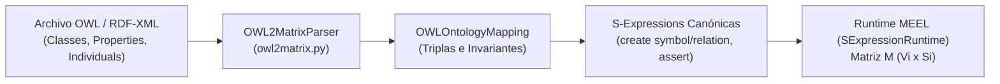

# Parser de Ingesta Automatizada OWL2Matrix

**Categoría Padre:** [[Computacion]]
**Relaciones 5W1H+:**
* [implements:: [[Eje_D_Diferenciacion_OWL_KGs_y_Vectorizacion_Bitwise]]]
* [implements:: [[S_Expressions]]]
* [is_solved_by:: [[Compilador_Matricial_Reglas]]]
* [is_solved_by:: [[Pipeline_Ingesta_Lenguaje_Matrix]]]
* [is_solved_by:: [[Multiplicacion_Matricial_Booleana_y_Clausura_Transitiva]]]
* [is_solved_by:: [[Algebra_Booleana]]]

---

## Qué es
Es el módulo compilador y parser (`src/operational_model/language/owl2matrix.py`) que permite importar ontologías ontológicas estándar Web Ontology Language (OWL / RDF-XML) y traducirlas automáticamente a **S-Expressions canónicas e ingresarlas en el motor MEEL**. OWL/RDF juega un doble rol en el pipeline: es una de las **representaciones estándar destino** de la etapa de descomposición del lenguaje natural, y un **formato importable directamente** (ya estandarizado, no requiere descomposición).

## Por qué es importante
Permite interoperabilidad inmediata con ontologías existentes (como las desarrolladas por Zöllner-Weber 2021 o bases de datos de conocimiento empresariales en OWL/RDF), transformando ontologías basadas en grafos en **matrices Booleanas bitwise densas** operadas a nivel de silicio (`uint64`).

## Flujo de Ingesta



## Demostración de Código Implementado

```python
from src.operational_model import LogicalSystem, SExpressionRuntime
from src.operational_model.language.owl2matrix import OWL2MatrixParser

system = LogicalSystem()
runtime = SExpressionRuntime(system)
parser = OWL2MatrixParser(runtime=runtime)

# Ingesta automatizada desde XML OWL
results = parser.ingest_into_runtime(owl_xml_content, wigame_name="wigame:owl_imported")

# Verificación determinista en tiempo de compilación
res = runtime.evaluate("(check wigame:owl_imported (hasIngredient RagoutChampinon Champinon))")
assert res.status == "accept"
```

## Verificación de Pruebas Unitarias
El parser cuenta con una suite de pruebas dedicadas en `tests/test_owl2matrix.py` (120/120 tests pasando en `pytest`).
