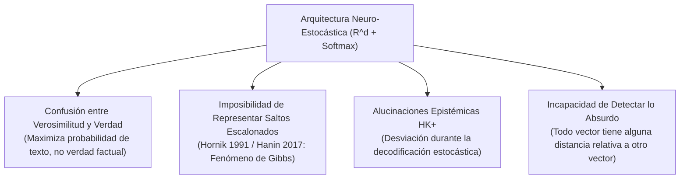

# Arquitectura Neuro-Estocástica

**Categoría Padre:** [[Filosofia]]
**Relaciones 5W1H+:**
* [defines:: [[Discretizacion_Logica_vs_Continuo]]]
* [defines:: [[Prueba_Necesidad_Representacion_Simbolica_Discreta]]]
* [defines:: [[Taxonomia_SOTA_Alucinaciones]]]
* [defines:: [[Acoplamiento_Neuro_Estocastico_Simbolico]]]
* [defines:: [[Teorema_Suboptimizabilidad_Diagonal]]]
* [defines:: [[Representacion_Plana_vs_Tensorial]]]

---

## Qué es
Es el paradigma dominante de la Inteligencia Artificial moderna basado en **redes neuronales profundas** (Transformers/LLMs) que operan sobre **espacios vectoriales continuos de alta dimensión ($\mathbb{R}^d$)** y ejecutan inferencia mediante el **muestreo de distribuciones de probabilidad estocásticas** (Softmax).

---

## Fundamentos Matemáticos y Operativos

1. **Representación Vectorial en $\mathbb{R}^d$:**
   * Las palabras y conceptos se representan como vectores densos continuos. La proximidad semántica se mide mediante distancias geométricas (similitud de coseno).
2. **Generación Probabilística de Tokens:**
   * En cada paso $t$, la red calcula la probabilidad del siguiente token mediante muestreo de Softmax:
     $$P(w_t \mid w_1, \dots, w_{t-1}) = \text{Softmax}(W \cdot h_t)$$
3. **Hipótesis Distributiva de Zellig Harris:**
   * "Palabras que aparecen en contextos estadísticos similares tienen significados similares."

---

## Límites Estructurales e Inevitabilidad de las Alucinaciones

---

## Necesidad de Acoplamiento Simbólico
Para resolver estos límites, la arquitectura neuro-estocástica debe acoplarse a una capa de representación Booleana discreta ([[Acoplamiento_Neuro_Estocastico_Simbolico]]), delegando en el kernel Booleano (MEEL) la verificación inmutable del Sentido ($S_i$) y la Verdad ($V_i$).
