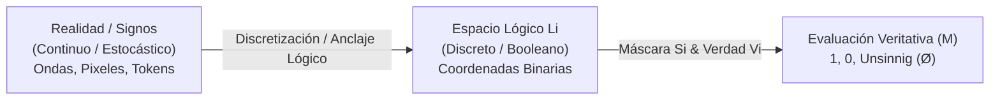

# Discretización Lógica vs. Continuidad Física y Perceptiva

**Categoría Padre:** [[Filosofia]]
**Relaciones 5W1H+:**
* [defines:: [[Signo_vs_Simbolo]]]
* [defines:: [[Modelo_SMG]]]
* [defines:: [[TractatusKnowledgeMachine/atoms/Filosofia/Tractatus]]]
* [defines:: [[Algebra_Booleana]]]

---

## Qué es
Es el principio ontológico que establece que mientras la realidad empírica, la percepción y los signos de superficie (texto, imágenes, ondas de sonido) son continuos y estocásticos, el **espacio lógico-simbólico ($L_i$) es discreto y cuantizable binariamente**.

## Por qué es necesario
Explica la falla fundamental de los modelos de lenguaje neuronales (LLMs): pretender que la validez formal, la no-contradicción y la aplicabilidad categorial son funciones continuas y suaves sobre vectores latentes. La lógica contiene discontinuidades absolutas (palo o no palo, verdad o falsedad, sentido o absurdo) que requieren primitivos discretos booleanos.

## Cómo funciona

1. **Dominio Continuo / Estocástico (Superficie $S$):** Los datos sensoriales y la emisión de tokens en lenguaje natural son probabilidades sobre un medio continuo.
2. **Cuantización / Anclaje Simbólico:** El sistema asigna los signos a coordenadas discretas en el espacio $L_i$.
3. **Dominio Booleano Discreto (Estructura $M \to G$):** Las operaciones de verdad ($V_i$), sentido ($S_i$) y deducción se ejecutan en semianillos booleanos discretos ($\land, \lor$), garantizando la ausencia de regiones de interferencia o alucinación continua.

## Cuándo interviene
En la fundamentación de la arquitectura del proyecto, la justificación del paper de posición y la interfaz entre redes neuronales y el kernel determinista.

## Dónde reside
En la frontera entre la Capa de Superficie ($S$) y la Capa de Significado ($M$) dentro del Modelo SMG.

## Para qué / Para quién
Proporciona la piedra angular teórica que demuestra por qué los modelos neuronales continuos requieren un sustrato simbólico discreto para lograr inmunidad a las alucinaciones.
