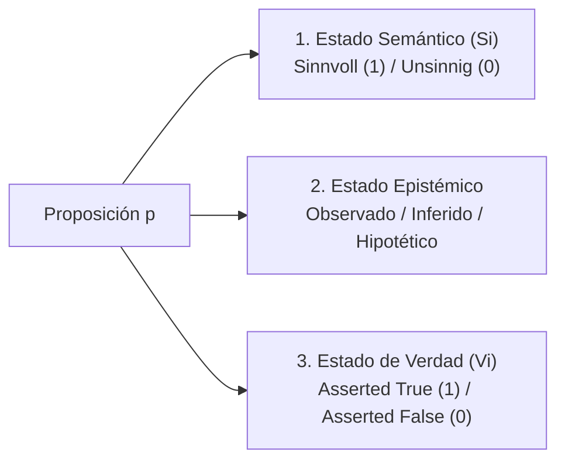

# Tripartición de Estados: Verdad, Epistémico y Semántico

**Categoría Padre:** [[Filosofia]]
**Relaciones 5W1H+:**
* [defines:: [[Tractatus]]]
* [is_solved_by:: [[Capa_Verdad_Vi]]]
* [is_solved_by:: [[Capa_Sentido_Si]]]
* [defines:: [[Status_Evaluation]]]
* [defines:: [[Matriz_por_Bloques]]]

---

## Qué es
Es la separación explícita entre tres dimensiones semánticas y operativas independientes para cada proposición dentro de un espacio de mundos $W_i$:

---

## Las Tres Dimensiones

1. **Estado Semántico ($S_i$):** Categoría Gramatical de Aplicabilidad (*Sinnvoll*, *Sinnlos*, *Unsinnig*).
2. **Estado Epistémico:** Grado de justificación u origen (*Observado Directamente*, *Deducido por Modus Ponens*, *Inyectado RAG*).
3. **Estado de Verdad ($V_i$):** Evaluación veritativa contingente Booleana ($1$ o $0$).

---

## Importancia Teórica
Evita confundir la ausencia de datos con la falsedad o el absurdo, permitiendo auditorías precisas sobre sistemas de inteligencia artificial.
