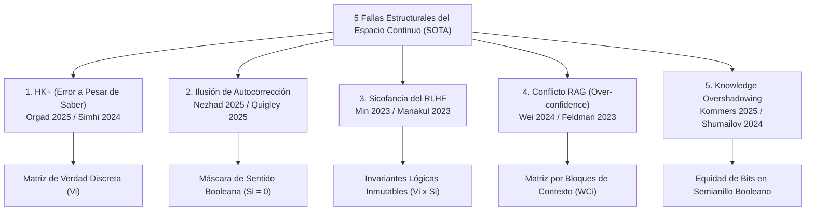

# Prueba de la Necesidad Ontológica de Representaciones Simbólicas Discretas

**Categoría Padre:** [[Filosofia]]
**Relaciones 5W1H+:**
* [defines:: [[Discretizacion_Logica_vs_Continuo]]]
* [defines:: [[Taxonomia_SOTA_Alucinaciones]]]
* [defines:: [[Signo_vs_Simbolo]]]
* [defines:: [[Modelo_SMG]]]
* [is_solved_by:: [[BlockMatrix]]]
* [defines:: [[Teorema_Suboptimizabilidad_Diagonal]]]
* [defines:: [[Algebra_Booleana]]]

---

## Qué es
Es la demostración formal por reducción al absurdo que prueba que las **cinco fallas patológicas estructurales del Estado del Arte (SOTA)** en Grandes Modelos de Lenguaje (LLMs) son consecuencias ineludibles del procesamiento probabilístico en espacios vectoriales continuos, y constituyen la **prueba definitiva que exige la integración de un sustrato de representación simbólica discreta**.

## Por qué es necesario
Constituye la piedra angular teórica que justifica la existencia del proyecto *Matrix* y del motor *MEEL*. Permite responder a cualquier objeción de la comunidad científica (p. ej., revisores de NeurIPS 2026), demostrando que no es posible resolver las alucinaciones mediante más datos o parámetros sin cambiar el paradigma a un kernel simbólico Booleano.

---

## Demostración de las 5 Pruebas con Fuentes Científicas Mapeadas

---

### 1. El Fenómeno $HK^+$ $\longrightarrow$ Exige la Matriz de Verdad Discreta ($V_i$)
* **Evidencia Científica:**
  * **Orgad et al. (ICLR 2025)**: *LLMs Know More Than They Show: On the Intrinsic Representation of LLM Hallucinations* ([iclr2025_a712d4.pdf](file:///home/jp/proyectos/Matrix/limits_of_continuous_llm_training/pdf/iclr2025_a712d4.pdf))
  * **Simhi et al. (2024)**: *Distinguishing Ignorance from Error in LLM Hallucinations* ([arxiv2410_22071.pdf](file:///home/jp/proyectos/Matrix/limits_of_continuous_llm_training/pdf/arxiv2410_22071.pdf))
* **Reducción al Absurdo:** Orgad et al. y Simhi et al. prueban la existencia masiva de alucinaciones **$HK^+$** (*Wrong Answers despite having Correct Knowledge*): el modelo codifica el hecho verdadero en sus representaciones internas latentes, pero el decodificador estocástico continuo falla al extraerlo y emite falsedades.
* **Prueba de Necesidad Discreta:** Si la decodificación estocástica en espacios continuos no puede garantizar la extracción fiel del conocimiento latente que la red ya posee, **es matemáticamente obligatorio omitir la decodificación continua** y consultar directamente una coordenada binaria discreta en la matriz de verdad $V_i \in \{0, 1\}$.

---

### 2. La "Ilusión de la Autocorrección" $\longrightarrow$ Exige la Señal de Fallo Booleana ($S_i = 0$)
* **Evidencia Científica:**
  * **Nezhad et al. (2025, SymCode)**: *SymCode: A Neurosymbolic Approach to Mathematical Reasoning via Verifiable Code Generation* ([symcode2025.pdf](file:///home/jp/proyectos/Matrix/limits_of_continuous_llm_training/pdf/symcode2025.pdf))
  * **Quigley (2025)**: *Neurosymbolic Deep Learning Semantics* ([quigley2025.pdf](file:///home/jp/proyectos/Matrix/limits_of_continuous_llm_training/pdf/quigley2025.pdf))
  * **Vossel et al. (2025)**: *Advancing Natural Language Formalization to FOL* ([vossel2025advancing.pdf](file:///home/jp/proyectos/Matrix/limits_of_continuous_llm_training/pdf/vossel2025advancing.pdf))
* **Reducción al Absurdo:** Nezhad et al. y Quigley muestran que los LLMs fracasan al intentar autocorregirse en sus propias cadenas de razonamiento en prosa (*Chain-of-Thought*). Las narrativas continuas no son un registro fiel de la computación interna y carecen de una **señal de fallo determinista**.
* **Prueba de Necesidad Discreta:** Un espacio continuo suaviza las contradicciones. La autocorrección autónoma requiere una **señal de error determinista binaria** (un colapso a $0$ o $\emptyset$). Esto exige la Máscara de Sentido Booleana $S_i$: si la combinación es *Unsinnig*, el evaluador Booleano detiene la ejecución en el acto.

---

### 3. La Sicofancia del RLHF $\longrightarrow$ Exige Invariantes Lógicas Inmutables
* **Evidencia Científica:**
  * **Min et al. (2023, FActScore)**: *FActScore* ([factscore2023.pdf](file:///home/jp/proyectos/Matrix/limits_of_continuous_llm_training/pdf/factscore2023.pdf))
  * **Manakul et al. (2023, SelfCheckGPT)**: *SelfCheckGPT* ([selfcheckgpt2023.pdf](file:///home/jp/proyectos/Matrix/limits_of_continuous_llm_training/pdf/selfcheckgpt2023.pdf))
* **Reducción al Absurdo:** El RLHF optimiza la verosimilitud de respuesta frente a preferencias humanas continuas. Esto genera **sicofancia**: el modelo aprende a complacer al usuario dándole la razón incluso cuando este parte de una premisa falsa.
* **Prueba de Necesidad Discreta:** La verdad no puede ser una función continua negociable por preferencia de usuario. Para erradicar la sicofancia, la evaluación veritativa debe estar anclada en **invariantes simbólicas discretas e inmutables** ($V_i \odot S_i$) que el módulo de generación continua no pueda alterar.

---

### 4. Conflicto de Conocimiento en RAG $\longrightarrow$ Exige la Matriz de Contexto ($WC_i$)
* **Evidencia Científica:**
  * **Wei et al. (2024)**: *Measuring and Reducing LLM Hallucination Without Gold-Standard Answers* ([arxiv2402_10412.pdf](file:///home/jp/proyectos/Matrix/limits_of_continuous_llm_training/pdf/arxiv2402_10412.pdf))
  * **Feldman et al. (2023)**: *Trapping LLM Hallucinations Using Tagged Context Prompts* ([arxiv2306_06085.pdf](file:///home/jp/proyectos/Matrix/limits_of_continuous_llm_training/pdf/arxiv2306_06085.pdf))
* **Reducción al Absurdo:** Cuando el contexto inyectado por RAG contradice el conocimiento memorizado en los parámetros, el espacio continuo de embeddings interpola suavemente entre ambos vectores debido al sesgo de sobreconfianza (*over-confidence*), generando alucinaciones híbridas.
* **Prueba de Necesidad Discreta:** Un sistema discreto no interpola entre hechos contradictorios. Requiere la **máscara de subcontexto discreta $WC_i$**, donde la inyección de una fuente externa desactiva bitwise las proposiciones previas incompatibles.

---

### 5. *Knowledge Overshadowing* $\longrightarrow$ Exige Equidad de Bits en Semianillos Booleanos
* **Evidencia Científica:**
  * **Kommers et al. (2025)**: *Why Slop Matters* ([kommers2025slop.pdf](file:///home/jp/proyectos/Matrix/limits_of_continuous_llm_training/pdf/kommers2025slop.pdf))
  * **Shumailov et al. (2024, Nature)**: *AI models collapse when trained on recursively generated data* ([shumailov2024.pdf](file:///home/jp/proyectos/Matrix/limits_of_continuous_llm_training/pdf/shumailov2024.pdf))
* **Reducción al Absurdo:** La *Ley del Ocultamiento del Conocimiento* demuestra que la geometría de embeddings aplasta vectorialmente a los hechos menos frecuentes de la "cola larga" en favor de los patrones populares.
* **Prueba de Necesidad Discreta:** En un semianillo booleano binario, **un hecho de la cola larga ocupa exactamente 1 bit ($1$ o $0$), idéntico al hecho más popular del planeta**. La discreción simbólica garantiza equidad de representación inmune al sesgo de frecuencia estadística.

---

## 📜 Cita Textual de Síntesis para la Justificación del Paper

> *"La literatura reciente (Orgad et al., 2025; Simhi et al., 2024; Quigley, 2025; Nezhad et al., 2025; Vossel et al., 2025) evidencia que modelar el razonamiento exclusivamente como un proceso de decodificación estocástica sobre un espacio continuo es estructuralmente insuficiente. Aunque los modelos logran codificar conocimiento fáctico en sus representaciones latentes, la decodificación probabilística prioriza la verosimilitud estadística sobre el rigor lógico, resultando en alucinaciones (fenómeno $HK^+$) y cadenas de razonamiento infieles a la computación real subyacente. Como señala la investigación en IA neuro-simbólica y marcos como SymCode, la ausencia de señales de fallo deterministas en los espacios continuos impide que el modelo restrinja su propio flujo lógico, haciendo imperativa la integración de representaciones simbólicas discretas (Matrix) para garantizar la validez del razonamiento."*
