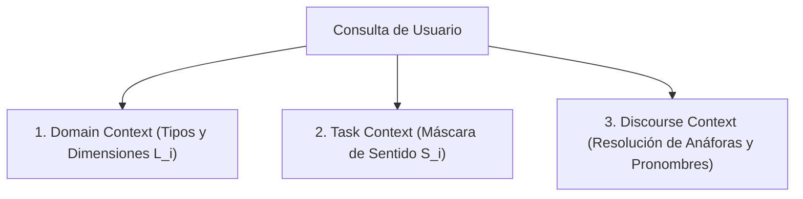

# Tripartición Contextual: Dominio, Tarea y Discurso

**Categoría Padre:** [[Filosofia]]
**Relaciones 5W1H+:**
* [is_solved_by:: [[BlockMatrix]]]
* [defines:: [[WiGame]]]
* [defines:: [[Prototipo_SHRDLU]]]
* [defines:: [[Modelo_SMG]]]
* [defines:: [[Matriz_por_Bloques]]]

---

## Qué es
Es la descomposición analítica (Anexo A.3.13) de las necesidades contextuales de una consulta real en tres capas independientes:

1. **Domain Context:** Define el vocabulario, tipos y relaciones válidas del universo.
2. **Task Context:** Define la máscara $S_i$ específica para la meta operativa actual.
3. **Discourse Context:** Mantiene la resolución de pronombres y anáforas en el diálogo (vía SHRDLU).
