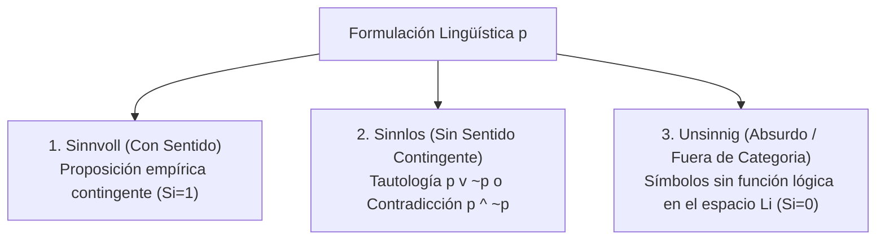

# Tripartición Wittgensteiniana de Sentido: Sinnvoll, Sinnlos y Unsinnig

**Categoría Padre:** [[Filosofia]]
**Relaciones 5W1H+:**
* [defines:: [[Tractatus]]]
* [defines:: [[Eje_F_Auditoria_Terminologica_Unsinnig]]]
* [is_solved_by:: [[Capa_Sentido_Si]]]
* [defines:: [[Estados_Verdad_Epistemicos_Semanticos]]]
* [defines:: [[Matriz_por_Bloques]]]
* [defines:: [[Algebra_Booleana]]]

---

## Qué es
Es la fundamentación filosófica tomada del *Tractatus Logico-Philosophicus* (Ludwig Wittgenstein, TLP 3.24) que clasifica todas las formulaciones lingüísticas en tres estados categoriales:

---

## Mapeo a la Arquitectura Matrix

* **Sinnvoll:** Proposiciones con coordenadas válidas en el espacio $L_i$ cuya facticidad contingente se evalúa en $V_i \in \{0, 1\}$.
* **Sinnlos:** Tautologías o contradicciones formales detectables por eliminación de la diagonal limpia $(W_i \otimes W_i^T) - \mathbf{I}$.
* **Unsinnig:** Formulaciones compuestas por símbolos sin función lógica asignada en el contexto activo. La Máscara de Sentido asigna **$S_i = 0$**, bloqueando su evaluación factual.
