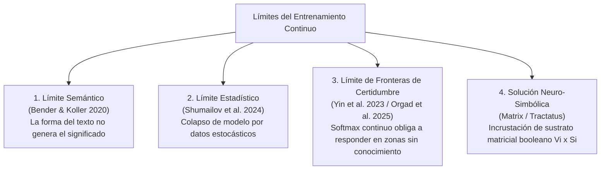

# Límites del Entrenamiento Continuo de LLMs

Esta carpeta reúne la literatura científica, filosófica y computacional sobre los **límites del entrenamiento continuo de modelos de lenguaje (LLMs)** y la necesidad de capas de representación simbólica discreta, a partir de las fuentes referenciadas en `/home/jp/proyectos/documents/tractatusBIt/references.bib`.

---

## 📁 Estructura del Material

| Documento | Descripción / Enfoque |
| :--- | :--- |
| 📄 **[01_theoretical_limits_continuous_embeddings.md](./01_theoretical_limits_continuous_embeddings.md)** | Fundamentos matemáticos: *Model Collapse* (Shumailov 2024), *Octopus Test* (Bender & Koller 2020), *Symbol Grounding* (Harnad 1990) y Modelos de Energía (LeCun 2022). |
| 📄 **[02_hallucination_benchmarks_and_metrics.md](./02_hallucination_benchmarks_and_metrics.md)** | Evidencia empírica y benchmarks: FActScore (Min 2023), HaluEval (Li 2023), SelfCheckGPT (Manakul 2023), Orgad (2025). |
| 📄 **[03_neuro_symbolic_and_fol_translations.md](./03_neuro_symbolic_and_fol_translations.md)** | Alternativas neuro-simbólicas, traducción a Lógica de Primer Orden (FOL) y Grafos de Conocimiento (Vossel 2025, Liu 2025, Ibrahim 2026, Peer 2025). |
| 📄 **[04_wittgenstein_and_knowledge_representation.md](./04_wittgenstein_and_knowledge_representation.md)** | Fundamentos tractarianos: Ontología de hechos, tripartición de sentido (*Sinnvoll, Sinnlos, Unsinnig*) y crítica al lenguaje privado en IA (Liu 2021, Zöllner-Weber 2021, CUP 2026). |
| 📄 **[05_bib_references_catalog.md](./05_bib_references_catalog.md)** | Catálogo exhaustivo anotado de las 28 referencias del archivo `references.bib`. |

---

## 🎯 Síntesis Central de los Límites

