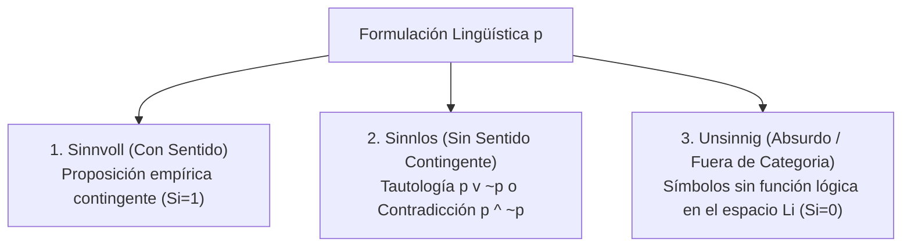

# Triparticion Wittgensteiniana Sinnvoll Sinnlos Unsinnig

Kind: kb-atom
Origin: ../TractatusKnowledgeMachine/atoms/Filosofia/Tractatus_y_Ontologia/Triparticion_Wittgensteiniana_Sinnvoll_Sinnlos_Unsinnig.md
Anchor: atom-triparticion-wittgensteiniana-sinnvoll-sinnlos-unsinnig

## Excerpt

Es la fundamentación filosófica tomada del *Tractatus Logico-Philosophicus* (Ludwig Wittgenstein, TLP 3.24) que clasifica todas las formulaciones lingüísticas en tres estados categoriales:

## Relevance

bridge=fase2_review score=0.9 — Tautología = Sinnlos.
