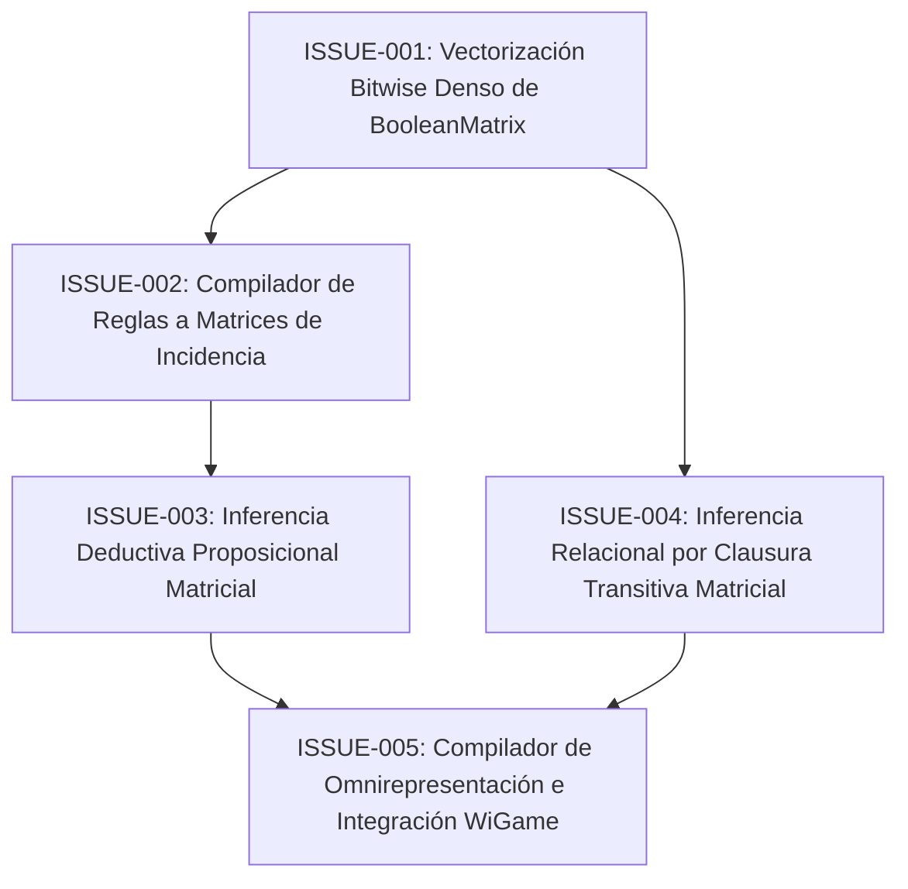

# Plan de Implementación: Engine Lógico sobre Matrices Booleanas Puras

Este documento define la ruta de trabajo determinista y el árbol de dependencias para colapsar toda la inferencia y evaluación sintáctica del motor Matrix a operaciones matriciales y de bits puras sobre el semianillo booleano $(\land, \lor)$.

---

## 🗺️ Mapa de Paralelización y Dependencias

---

## 📋 Lista de Tareas / Issues

| ID | Título | Estado | Dependencias | Archivos Clave |
| :--- | :--- | :---: | :--- | :--- |
| **[ISSUE-001](./ISSUE-001_bitwise_boolean_matrix.md)** | Vectorización Bitwise Denso de `BooleanMatrix` | ⏳ Pendiente | Ninguna | `matrices/boolean_matrix.py` |
| **[ISSUE-002](./ISSUE-002_rule_matrix_compiler.md)** | Compilador de Reglas a Matrices de Incidencia $I$ y Cláusulas $(C^+, C^-)$ | ⏳ Pendiente | ISSUE-001 | `kernel/rule_matrix.py` |
| **[ISSUE-003](./ISSUE-003_matrix_deductive_inference.md)** | Inferencia Deductiva Proposicional Matricial ($v \otimes I^*$) | ⏳ Pendiente | ISSUE-002 | `kernel/formula_inference.py` |
| **[ISSUE-004](./ISSUE-004_matrix_transitive_closure.md)** | Reemplazo de Inferencia Relacional por Clausura Transitiva Matricial ($M_R^*$) | ⏳ Pendiente | ISSUE-001 | `core/transitive_inference.py` |
| **[ISSUE-005](./ISSUE-005_block_matrix_omnirepresentation_wigame.md)** | Compilador de Omnirepresentación por Bloques e Integración en `WiGame` | ⏳ Pendiente | ISSUE-003, ISSUE-004 | `system/wigame.py` |

---

## 🎯 Criterio de Éxito Global

1. **Cero bucles sobre AST en Inferencia**: Modus Ponens, Silogismo Hipotético y Silogismo Disyuntivo ejecutados vía $v \otimes I^*$ y propagación de bits.
2. **Cero bucles sobre Diccionarios en Transitividad**: Inferencia transitiva $aRb \land bRc \implies aRc$ calculada como $M_R^* = M_R.recursive\_power()$.
3. **100% de Pruebas Pasando**: Mantener los 114 tests existentes y añadir pruebas de verificación matricial.
