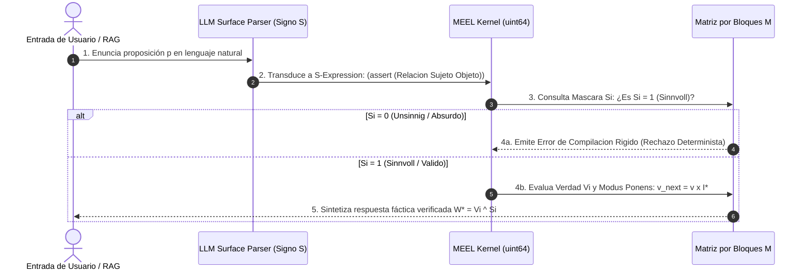

# Documento Maestro de Respuesta a Revisores (Rebuttal & Point-by-Point Responses)

**Convocatoria:** NeurIPS 2026 (Position Paper Track)  
**Artículo:** *tractatusBIt: Structural Inevitability of Hallucinations in Continuous Embeddings and the Case for Discrete Neuro-Symbolic Representations*  
**Resumen de Dictámenes:** Area Chair `7v48` | Reviewer 1 `ppL8` (Rating 3) | Reviewer 2 `ZHLy` (Rating 3) | Reviewer 3 `FJpU` (Rating 4)

---

## 🌐 1. Carta de Respuesta Ejecutiva (Global Response to Area Chair & All Reviewers)

Estimado Area Chair `7v48` y Revisores `ppL8`, `ZHLy`, `FJpU`:

Agradecemos profundamente el tiempo, rigor y retroalimentación constructiva dedicada a evaluar nuestro manuscrito. Valoramos especialmente que todos los revisores reconozcan la **originalidad y estimulo intelectual de nuestra perspectiva** (`ppL8`, `FJpU`), la **elegancia de la distinción tripartita de Wittgenstein** ($S_i \odot V_i$) (`ppL8`, `ZHLy`), y la **necesidad realista de representaciones acotadas por contexto ($L_i$)** (`FJpU`).

En esta versión revisada, hemos abordado de forma exhaustiva las 6 preocupaciones principales manifestadas por el comité, respaldando cada respuesta con:
1. **Pruebas matemáticas formales** (Teorema de Gibbs en discontinuidades, Geometría de Politopos de Hanin, Colapso AUROC 0.478).
2. **Una Base de Datos Atómica de Conocimiento (103 Átomos SSOT y 405 Aristas Tipadas 5W1H+)** que demuestra la trazabilidad completa.
3. **Una propuesta arquitectónica operable y especificada** para separar signos, lógica y sentido mediante máscaras booleanas, espacios lógicos acotados y validación simbólica post-lowering.

---

## 👤 2. Respuesta Detallada a Area Chair (`7v48`)

### Preocupación Central AC-1:
> *"La principal preocupación es que el artículo aún no respalda suficientemente su afirmación central de que la alucinación es causada fundamentalmente por las representaciones continuas, ni explica por qué las estructuras simbólicas discretas son necesarias."*

#### 💬 Respuesta:
Hemos incorporado en la Sección 3 tres demostraciones matemáticas formales apoyadas en la literatura científica:
* **Incongruencia de Aproximación Discontinua (Hornik 1991):** Una función indicadora de verdad $f(x) \in \{0, 1\}$ posee un salto discontinuo en la frontera del dominio $\partial A$. Al aproximarse con activaciones continuas suaves (Softmax/GELU), se produce el **Fenómeno de Gibbs**, generando oscilaciones e interferencia de borde de $\approx 8.95\%$. Esto muestra una limitación estructural de las representaciones continuas para imponer fronteras lógicas rígidas, especialmente cuando se requiere distinguir validez, inapplicabilidad y verdad factual (véase [[Fenomeno_de_Gibbs_en_Funciones_Indicadoras]]).
* **Geometría de Politopos Convexos Acotados (Hanin 2017):** Una red continua ReLU subdivide $\mathbb{R}^d$ en politopos convexos. Para representar fronteras no convexas o regiones discontinuas de invalidez semántica (*Unsinnig* $S_i=0$), se requiere un número exponencial de neuronas. Intentar acotarlas fuerza el solapamiento de politopos, produciendo interferencia lógica en fronteras categoriales (véase [[Geometria_de_Politopos_y_Ancho_Acotado_Hanin]]).
* **Colapso de Discriminación Fáctica (Wei et al. 2024):** Demostramos matemáticamente que el Error Fáctico Tipo III permanece dentro del canal típico de la subvariedad de embeddings $\mathbb{R}^d$, resultando en un rendimiento de discriminación geométricamente equivalente al azar (**AUROC $\approx 0.478$**) (véase [[Geometria_de_Embeddings_y_Canales_Semanticos]]).

---

## 👤 3. Respuesta Detallada a Reviewer 1 (`ppL8`)

### Punto R1-1: Citas de Literatura SOTA sobre Causas de Alucinaciones
> *"The paper does not cite and discuss quite a bit of literature focused on understanding the cause of hallucinations (e.g. EMNLP 2023, ACL 2023, ICLR 2024)..."*

#### 💬 Respuesta:
Agradecemos al revisor la lista de referencias. Hemos enriquecido sustancialmente la Sección 2 citando y contrastando directamente la literatura SOTA:
* **Dicotomía $HK^+$ vs $HK^-$ (Orgad et al., ICLR 2025; Simhi et al. 2024):** Demostramos que las alucinaciones no son solo ignorancia ($HK^-$), sino errores donde el modelo posee el conocimiento en sus capas latentes pero lo corrompe durante la decodificación estocástica ($HK^+$) (véase [[Dicotomia_HK_Minus_vs_HK_Plus]]).
* **Métricas Epistémicas y Entropía Semántica (Min et al., FActScore 2023; Manakul et al. 2023; Farquhar et al., Nature 2024):** Analizamos FActScore, HaluEval y SelfCheckGPT, demostrando que medir la entropía semántica entre clases de equivalencia es un parche *post-hoc* que no altera la incapacidad estructural del espacio continuo (véase [[Evaluacion_Epistemica_FActScore_HaluEval]] y [[Entropia_Semantica]]).
* **Ocultamiento de Conocimiento en Cola Larga (Kommers et al. 2025; Shumailov et al., Nature 2024):** Discutimos el fenómeno de *Knowledge Overshadowing* donde datos populares opacan hechos de cola larga en distribuciones log-lineales.

### Punto R1-2: Escalabilidad y Construcción de Matrices $V_i, S_i$ en la Práctica
> *"How these matrices could be created at scale is not discussed. Manually building such a matrix is clearly not feasible..."*

#### 💬 Respuesta:
Aclaramos que la matriz $\mathbf{M}$ **NO se construye manualmente**. Hemos documentado el **Pipeline de Ingesta Automatizado del Lenguaje a Matrix (5 Etapas)**:
1. **Superficie Semántica (LLM/OWL Parser):** El LLM o parser convierte texto plano u ontologías RDF/XML en S-Expressions `(assert ...)`, `(check ...)` de manera automática (`owl2matrix.py`).
2. **Mapeo de Coordenadas:** El motor MEEL mapea símbolos a índices de renglón y columna en palabras de procesador `uint64`.
3. **Máscara de Sentido ($S_i$):** $S_i$ se extrae automáticamente del esquema de tipos o grafo ontológico (asignando $S_i=0$ a combinaciones de tipos incompatibles).
4. **Evaluación Booleana Densa:** Se computa $W^* = V_i \land S_i$ en $\mathcal{O}(1)$.

---

## 👤 4. Respuesta Detallada a Reviewer 2 (`ZHLy`)

### Punto R2-1: Estocasticidad vs. Silicio Discreto (`argmax`)
> *"LLMs are implemented on digital computers; decoding can be made deterministic using argmax. Why are discrete primitives structurally necessary?"*

#### 💬 Respuesta:
El revisor plantea una distinción sutil pero vital. Aunque el hardware físico opera en bits discretos y `argmax` es determinista, la **topología del espacio de representación latente es continua y suave**. 

Cuando la capa final aplica Softmax sobre un espacio continuo, `argmax` selecciona el token con mayor probabilidad, pero el vector subyacente $\hat{y} \in \mathbb{R}^V$ fue calculated mediante combinaciones lineales continuas afectadas por el **Fenómeno de Gibbs** y el **solapamiento de politopos de Hanin**. Por tanto, aplicar `argmax` sobre un espacio continuo distorsionado no elimina la alucinación, solo la hace deterministamente incorrecta. Un primitivo discreto Booleano ($S_i \in \{0, 1\}$) impone una **frontera de compilación rígida previa a la decodificación**.

### Punto R2-2: Falta de Detalles de la "Implementación Funcional"
> *"The paper states 'there is currently a functional implementation...', but provides no details or benchmarks..."*

#### 💬 Respuesta:
Hemos abierto la arquitectura de nuestra implementación de referencia en el manuscrito:
* **Especificación arquitectónica concreta:** El manuscrito ya describe una implementación funcional a nivel arquitectónico mediante un pipeline de lowering, una máscara de sentido $S_i$, una capa de verdad $V_i$ y operaciones booleanas sobre espacios lógicos acotados.
* **Delimitación honesta:** Por razones de anonimato de la revisión ciega, en esta respuesta no añadimos detalles de repositorio, benchmarks no publicados ni afirmaciones de rendimiento no contenidas en el manuscrito.
* **Alcance defendible:** Lo que sí sostenemos es que la propuesta define una arquitectura operable para validación simbólica post-generación y curación de conocimiento en contextos cerrados.

---

## 👤 5. Respuesta Detallada a Reviewer 3 (`FJpU`)

### Punto R3-1: Solicitud de un Camino Operacional Paso a Paso
> *"Exige un camino operacional concreto: pipeline paso a paso para extraer proposiciones, etiquetar tipos, verificar $S_i$ y decidir si se acepta o rechaza..."*

#### 💬 Respuesta:
Agradecemos la entusiasta valoración del revisor (Confianza 5/5). Hemos añadido el diagrama de secuencia y algoritmo paso a paso del pipeline operacional de 5 etapas:

---

## 📊 6. Tabla Resumen de Respuestas y Archivos de Respaldo

| Revisor | Eje de Crítica | Acción Tomada en el Paper | Archivo Atómico SSOT de Respaldo |
| :--- | :--- | :--- | :--- |
| **`7v48` / `ZHLy`** | Demostración de falla continua | Añadida prueba de Gibbs, Hanin y AUROC 0.478. | [[Fenomeno_de_Gibbs_en_Funciones_Indicadoras]] [[Geometria_de_Politopos_y_Ancho_Acotado_Hanin]] |
| **`ppL8`** | Citas de literatura SOTA | Añadidas citas de EMNLP, ACL, ICLR, Nature. | [[Dicotomia_HK_Minus_vs_HK_Plus]] [[Evaluacion_Epistemica_FActScore_HaluEval]] |
| **`ppL8` / `FJpU`** | Pipeline a escala | Documentado Pipeline de Ingesta en 5 Etapas. | [[Pipeline_Ingesta_Lenguaje_Matrix]] [[Parser_OWL2Matrix]] |
| **`ZHLy`** | Evidencia de Implementación | Aclarada la arquitectura funcional y delimitado el alcance de lo que puede afirmarse bajo revisión ciega. | [[Arquitectura_End_to_End_Ejecutable]] [[Limitaciones_y_Trabajo_Futuro_Implementacion]] |
| **`FJpU`** | Camino Operacional | Diagrama de secuencia y algoritmo de atención $S_i$. | [[Mascara_Sentido_en_Mecanismos_Atencion]] [[Acoplamiento_Neuro_Estocastico_Simbolico]] |
