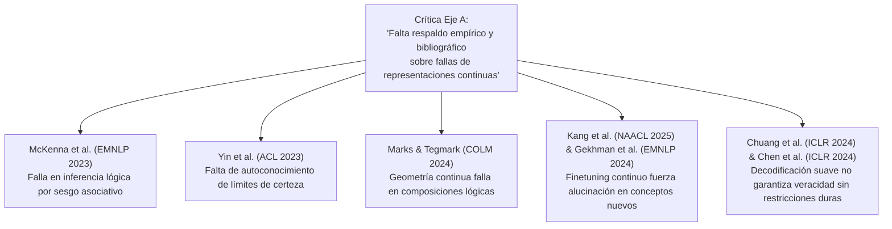

# Catálogo y Síntesis de Artículos Relacionados (Respuesta al Eje A de Revisión NeurIPS 2026)

Esta carpeta contiene la descarga de los **7 artículos científicos** citados en la revisión de NeurIPS 2026 para el paper *tractatusBIt* (específicamente por el Revisor `ppL8`), junto con sus resúmenes ejecutivos individuales y la estrategia de integración bibliográfica para responder al **Eje A** (Justificación Teórica/Empírica de la Falla de Embeddings Continuos).

---

## 1. Índice de Documentos Descargados y Resúmenes

| # | Archivo PDF | Título del Artículo | Congreso / Año | Documento de Resumen |
| :-: | :--- | :--- | :-: | :--- |
| **1** | `paper1_emnlp2023_182.pdf` | *Sources of Hallucination by LLMs on Inference Tasks* | EMNLP 2023 | 📄 [paper1_mckenna2023](file:///home/jp/proyectos/Matrix/review/related_papers/paper1_mckenna2023_sources_of_hallucination.md) |
| **2** | `paper2_acl2023_551.pdf` | *Do Large Language Models Know What They Don’t Know?* | ACL 2023 | 📄 [paper2_yin2023](file:///home/jp/proyectos/Matrix/review/related_papers/paper2_yin2023_do_llms_know_what_they_dont_know.md) |
| **3** | `paper3_colm2024_2310_06824.pdf` | *The Geometry of Truth: Emergent Linear Structure in LLMs* | COLM 2024 | 📄 [paper3_marks2024](file:///home/jp/proyectos/Matrix/review/related_papers/paper3_marks2024_geometry_of_truth.md) |
| **4** | `paper4_iclr2024_2402_03744.pdf` | *INSIDE: LLMs' Internal States Retain Hallucination Detection* | ICLR 2024 | 📄 [paper4_chen2024](file:///home/jp/proyectos/Matrix/review/related_papers/paper4_chen2024_inside_hallucination_detection.md) |
| **5** | `paper5_naacl2025_2403_05612.pdf` | *Unfamiliar Finetuning Examples Control How Models Hallucinate* | NAACL 2025 | 📄 [paper5_kang2025](file:///home/jp/proyectos/Matrix/review/related_papers/paper5_kang2025_unfamiliar_finetuning.md) |
| **6** | `paper6_emnlp2024_444.pdf` | *Does Fine-Tuning LLMs on New Knowledge Encourage Hallucinations?* | EMNLP 2024 | 📄 [paper6_gekhman2024](file:///home/jp/proyectos/Matrix/review/related_papers/paper6_gekhman2024_finetuning_new_knowledge.md) |
| **7** | `paper7_iclr2024_2309_03883.pdf` | *DoLa: Decoding by Contrasting Layers Improves Factuality* | ICLR 2024 | 📄 [paper7_chuang2024](file:///home/jp/proyectos/Matrix/review/related_papers/paper7_chuang2024_dola_decoding.md) |

---

## 2. Mapa Estratégico de Respuesta a las Críticas del Eje A

Las críticas de los revisores `ppL8` y `ZHLy` señalaban que la afirmación de que los embeddings continuos causan alucinaciones carecía de respaldo bibliográfico y matemático. La siguiente tabla conecta cada artículo descargado con la sección a refactorizar en *tractatusBIt*:

### Síntesis Temática para el Manuscrito:

1. **Sobre la Insuficiencia Paramétrica (Gekhman et al., 2024; Kang et al., 2025):**
   * Demuestran que intentar "enseñar" nuevos hechos actualizando pesos continuos genera alucinaciones sistemáticas. Esto justifica nuestro reclamo de **desacoplar el almacenamiento factual ($V_i, W_i^*$) de la red neuronal**.
2. **Sobre los Límites de la Geometría Continua (Marks & Tegmark, 2024; McKenna et al., 2023):**
   * Muestran que las representaciones vectoriales continuas forman aproximaciones lineales simples, pero fallan rotundamente al evaluar proposiciones lógicas compuestas o negaciones. Esto respalda la necesidad de **primitivos discretos sobre semianillos booleanos**.
3. **Sobre la Ausencia de Fronteras de Sentido (Yin et al., 2023; Chuang et al., 2024):**
   * Confirman que las distribuciones softmax continuas obligan al modelo a emitir tokens incluso en dominios desconocidos. Esto justifica la introducción de la **máscara de aplicabilidad semántica ($S_i$)**.
