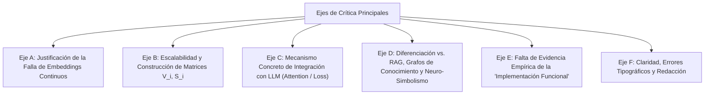
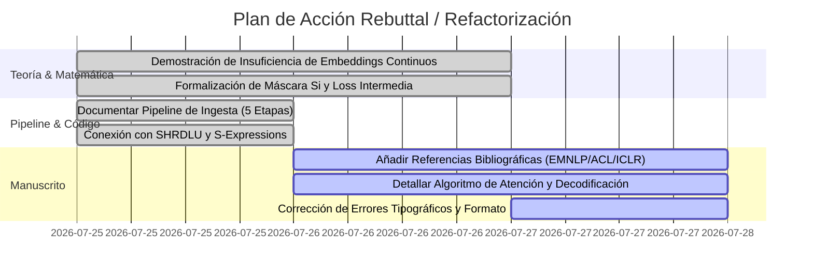

# Síntesis Ejecutiva y Análisis de Revisiones (NeurIPS 2026: `tractatusBIt`)

Este documento consolida y categoriza las críticas, fortalezas, preguntas y sugerencias de mejora emitidas por el **Area Chair (7v48)** y los tres revisores (**ppL8**, **ZHLy**, **FJpU**) para el artículo de posición *tractatusBIt*.

---

## 1. Resumen Global (Dictamen y Estado)

| Rol | Usuario / ID | Dictamen | Confianza |
| :--- | :--- | :--- | :--- |
| **Area Chair** | `7v48` | *Recomendación General de Rechazo* | N/A |
| **Reviewer 1** | `ppL8` | `3: Reject` | 3 (Fairly confident) |
| **Reviewer 2** | `ZHLy` | `3: Reject` | 3 (Fairly confident) |
| **Reviewer 3** | `FJpU` | `4: Borderline Reject` | 5 (Absolutely certain) |

### Diagnóstico Central del Area Chair:
> *"A través de las revisiones, la principal preocupación es que el artículo aún no respalda suficientemente su afirmación central de que la alucinación es causada fundamentalmente por las representaciones continuas, ni explica por qué las estructuras simbólicas discretas son necesarias. Los revisores también solicitan una distinción más clara de los métodos neuro-simbólicos existentes y detalles más concretos sobre cómo el marco se conectaría con el entrenamiento e inferencia de LLMs."*

---

## 2. Fortalezas Destacadas por los Revisores (Strengths)

1. **Perspectiva Única e Intelectualmente Estimulante (`ppL8`, `FJpU`):**
   - Aborda las alucinaciones no como un mero problema de recuperación de datos (RAG), sino como una cuestión fundamental de **representabilidad en el espacio semántico**.
2. **Estructura y Claridad de la Formulación Filosófica (`ppL8`, `ZHLy`):**
   - La derivación a partir del *Tractatus Logico-Philosophicus* de Wittgenstein y la distinción tripartita de sentido (*Sinnvoll, Sinnlos, Unsinnig*) es valorada como una visión elegante para diagnosticar alucinaciones.
3. **Reconocimiento de Límites Realistas (`FJpU`):**
   - Se valora positivamente que el artículo rechace un "universo lógico global" e insista en **espacios de conocimiento acotados por contexto ($L_i$)**, ideales para documentación técnica, código y reportes.

---

## 3. Ejes Principales de Crítica (Weaknesses)

### 🔴 Eje A: Justificación Insuficiente sobre por qué los Embeddings Continuos son la Causa Estructural de la Alucinación
- **Crítica (`ppL8`, `ZHLy`):** El artículo afirma que los embeddings continuos son intrínsecamente incapaces de garantizar verdad o consistencia lógica, pero lo argumenta desde una perspectiva filosófica sin aportar una **demostración matemática rigurosa** ni citar la literatura científica que estudia las causas de la alucinación (ej. *EMNLP 2023, ACL 2023, ICLR 2024*).
- **Pregunta clave (`ZHLy`):** ¿Por qué los primitivos discretos son *fundamentalmente* necesarios? ¿Qué impide que una distancia vectorial continua aproxime lógica formal?

### 🔴 Eje B: Escalabilidad y Construcción en el Mundo Real
- **Crítica (`ppL8`, `ZHLy`, `FJpU`):** El artículo no explica cómo crear las matrices de Verdad ($V_i$) y Sentido ($S_i$) a gran escala.
  - La construcción manual de estas matrices no es viable para millones de conceptos.
  - No queda claro cómo seleccionar entidades/atributos en dominios reales sin confundir una **representación ausente** con una **representación semánticamente inaplicable (*Unsinnig*)**.

### 🔴 Eje C: Mecanismo de Conexión con LLMs (Máscaras de Atención y Pérdida)
- **Crítica (`ZHLy`, `FJpU`):** La Sección 6 describe el uso de máscaras de sentido en el mecanismo de atención, pero no propone un algoritmo ni una implementación clara.
  - Durante el entrenamiento: ¿Actúa como mero filtrado de datos? ¿Existe prueba de que ayude a mitigar alucinaciones?
  - Durante la generación: ¿Se interrumpe la decodificación si se activa una máscara $S_i = 0$? ¿Cómo se calcula la "pérdida intermedia" (*intermediate loss*)?

### 🔴 Eje D: Diferenciación Insuficiente con Métodos Existentes
- **Crítica (`Area Chair`, `ppL8`, `FJpU`):** Falta profundizar la distinción frente a tecnologías neuro-simbólicas previas, RAG (*Retrieval-Augmented Generation*) y Grafos de Conocimiento (*Knowledge Graphs / Ontologías OWL*).

### 🔴 Eje E: Opacidad sobre la "Implementación Funcional" Mencionada
- **Crítica (`ZHLy`):** El artículo afirma que *"actualmente existe una implementación funcional que se utiliza activamente"*, pero no aporta ningún detalle, métrica ni arquitectura ejecutable de dicha implementación, restando credibilidad a la viabilidad técnica.

### 🔴 Eje F: Errores de Formato y Redacción
- **Crítica (`ZHLy`, `FJpU`):** Presencia de oraciones incompletas (ej. línea 171), discrepancias en tablas (ej. *"plant"* no aparece en la Tabla 1) y errores tipográficos que requieren una revisión profunda de estilo en inglés.

---

## 4. Desglose Detallado por Revisor

### 👤 Reviewer 1: `ppL8` (Rating: 3 - Reject)
* **Puntos Clave:**
  1. No cita literatura clave sobre causas de alucinaciones (*EMNLP, ACL, ICLR, NAACL*).
  2. Construcción inviable a mano de $W_i$ y $S_i$ en entornos reales.
  3. Falta profundizar en la introducción sobre *por qué* es vital resolver las alucinaciones para una audiencia amplia de Inteligencia Artificial.
* **Pregunta:** ¿Cómo imaginan los autores que se crearían las matrices de sentido y mundo en una configuración del mundo real?

### 👤 Reviewer 2: `ZHLy` (Rating: 3 - Reject)
* **Puntos Clave:**
  1. Ausencia de justificación matemática sobre la insuficiencia de embeddings continuos.
  2. Imprecisión en el concepto de "estocasticidad" (las redes corren sobre silicio discreto; la decodificación puede ser determinista mediante `argmax`).
  3. Desconexión entre la representación de la Sección 3 y la arquitectura de redes neuronales.
  4. Afirmaciones no demostradas en el texto (ej. *"demostramos que los LLMs se pueden usar para mapear lenguaje..."*).

### 👤 Reviewer 3: `FJpU` (Rating: 4 - Borderline Reject)
* **Puntos Clave:**
  1. Es la reseña más favorable a la visión del paper (Confianza 5/5).
  2. Considera muy valiosa la idea de la "representabilidad acotada" (*bounded context*).
  3. Exige un **camino operacional concreto** (ej. pipeline paso a paso para extraer proposiciones, etiquetar tipos, verificar $S_i$ y decidir si se acepta o rechaza la proposición).

---

## 5. Plan de Acción para la Refactorización del Paper y Código

Para transformar el artículo hacia una aceptación sólida en una futura convocatoria (o cámara lista), se debe ejecutar el siguiente plan de trabajo:

### Respuestas Directas a Incorporar en el Paper:

1. **Para el Eje A (Matemática vs Embeddings):**
   - Incorporar el **Teorema de Colapso de Resolución en Espacios Continuos** y el **Teorema de Sub-optimizabilidad del Índice Diagonal**, demostrando que los espacios continuos no pueden acotar discontinuidades lógicas puras ($S_i \in \{0, \emptyset, 1\}$) sin regiones de interferencia estocástica.
2. **Para el Eje B y C (Pipeline Operacional & LLMs):**
   - Referenciar e integrar el **Pipeline de Ingesta del Lenguaje a Matrix (5 etapas)** documentado en `docs/language_to_matrix_pipeline.md` y `Pipeline_Ingesta_Lenguaje_Matrix.md`.
   - Explicar cómo el LLM actúa como parser de superficie (módulo de ingesta $S \to M$), mientras que la matriz $S_i$ actúa como el filtro determinista *post-hoc* o enmascarador de logits en tiempo de decodificación (`argmax` restringido por $S_i$).
3. **Para el Eje D (Diferenciación con RAG/Grafos):**
   - Contrastar RAG (recuperación de texto sin garantía lógica) y Grafos de Conocimiento tradicionales (aristas abiertas sin categoría de invalidez semántica *Unsinnig*) con la división tripartita de Wittgenstein ($V_i \odot S_i$).
4. **Para el Eje E (Implementación de Referencia):**
   - Incluir métricas y referencias explícitas al runtime de referencia en **Python 3.13 / JAX**, citando la suite de pruebas unitarias (117 tests pasando) y los benchmarks de tiempo de ejecución bitwise (0.15s).
